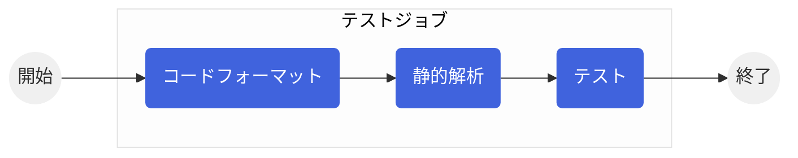
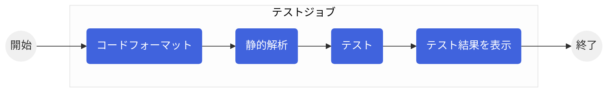
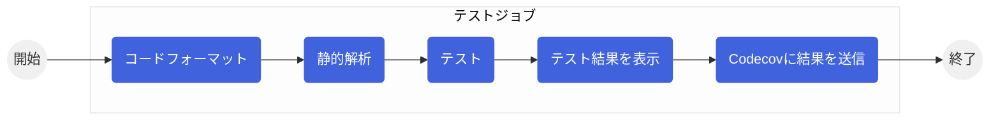
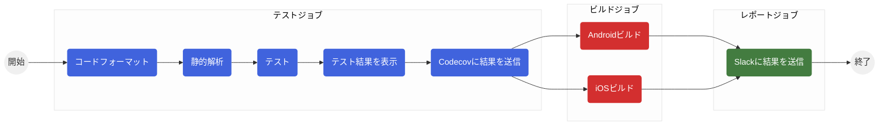

<div class="absolute top-10">
  <span class="font-700">
    2022/5/18 すさ ＠Flutter大学勉強会
  </span>
</div>

<div class="absolute bottom-10">
  <h1>明日から構築できる<br>Flutter CI 入門</h1>
  <p>GitHub Actions で CI を構築する方法を徹底解説</p>
</div>

---
layout: statement
---

# 今日のゴール

<br>

<v-click>

🌱 CI の必要性を理解する

</v-click>

<v-click>

✨ CI を自力で構築できるようになる

</v-click>

<v-click>

🔥 復習

</v-click>

<style>
p {
  font-size: 30px;
}
</style>

---

# 自己紹介


すさ

Twitter: [@susatthi](https://twitter.com/susatthi) / GitHub: [@susatthi](https://github.com/susatthi) / #times_すさ

都内在住 ２児のパパ兼フリーランスエンジニア（５年目）、自動化大好きマン<br>
Flutter大学 2020年7月〜、 Flutter 歴は約 2 年、<br>
最近の仕事は Swift / PHP、個人開発で Flutter を使っています。<br>
個人アプリ「医療費を管理して賢く節税」をリリースしています！


---

# もくじ

<div grid="~ cols-2 gap-4">
<div>

- はじめに

- CI
  - CI とは何か？
  - CI の位置づけ
  - CI 導入のメリットとデメリット
  - CI の構築方法

- GitHub Actions
  - GitHub Actions とは
  - YAML とは
  - ワークフローの構成
  - ワークフローの定義方法
  - 実例

</div>
<div>

- Tips
  - ローカルテストを楽にしよう
  - リファレンスアプリの紹介

- コラム

- さいごに

発表時間 55 分（質疑 5 分）

</div>
</div>

---

# はじめに

<br>

想像してください。あなたはスタートアップの Flutter エンジニアです。

アプリをリリースして半年が経ちユーザ数も伸びてきたところで次の課題に直面しています。

- ユーザからのバグ報告が増えてきた
  - 「バージョンアップしたらアプリが落ちるようになりました😡」
  - 「昨日から通知が来ません😅」

- バグを修正するたびに別のバグが発生して新機能の開発が進まない

<div class="absolute bottom-10">
  <p>継続してアプリを成長させていくためには品質を維持する必要がありました。</p>
  <p>そこで、リリース前のテストを導入しました。</p>
</div>

---

テストシナリオを作って、テスターを雇い、リリース前テストを導入しました。

するとユーザからのバグ報告は減り、新機能の開発が進むようになりました。

しかし、しばらくするとまた新たな課題が見つかります。

- アプリが成長するにつれリリース前テストが増えて工数が増えてきた
- リリース毎にほぼ同じテストをしている
- リリース前にしかテストをしないのでバグの発見が遅い

<div class="absolute bottom-10">
  <p>解決策を調べていると "CI" というものを導入するとよさそうなのでもっと調べてみることにしました。</p>
  <p align="right">つづく</p>
</div>

---
layout: section
---

# CI
## Continuous Integration (継続的インテグレーション)

---

# CI とは何か？

<br>

## 短いサイクルで自動テストをして品質を維持しながら開発をすること

ここで言う『テスト』とは次の 3 つのことを指しています。

① コードフォーマット

② 静的解析

③ テスト

<div class="absolute bottom-10">
  <p>なお、今回 CD (継続的デリバリー) は扱いません。</p>
  <p>CD とは、自動的にデプロイやストア配信をしていち早くユーザにプロダクトを届けることです。</p>
</div>

---

# ① コードフォーマット

ソースコードが見やすく整形されているかをチェック・修正することです。

<div grid="~ cols-2 gap-4">
<div>

<center>
❌ フォーマットしていないコード
<br>
<br>

</center>

</div>
<div>

<center>
✅ フォーマットしているコード
<br>
<br>

</center>

</div>
</div>

---

# Format on Save を有効にしよう

保存時に自動でフォーマットしてくれるので、自分でコードの整形に時間をかけずにすみ、またコードレビューで余計な指摘をされずにすみます。

<div grid="~ cols-2 gap-4">
<div>


</div>
<div>


</div>
</div>

---

# ② 静的解析

公式が推奨するコーディングスタイルに従っているか解析することです。

<div grid="~ cols-2 gap-4">
<div>


</div>
<div>


<center>
<p>
linter rule: <a href="https://dart-lang.github.io/linter/lints/sort_constructors_first.html">sort_constructors_first</a>
</p>
</center>

</div>
</div>

---

# 静的解析を導入しよう

ルールを書いた analysis_options.yaml をプロジェクトルートに置いておくと、IDE が自動で解析して指摘してくれます。
コーディングスタイルをチームで統一できるとコードレビューで余計な指摘をされずにすみます。あと単純にキレイなコードが書けるようになります。

デフォルトで入っている [lints](https://pub.dev/packages/lints) パッケージでもよいし、より厳しくしたければ [pedantic_mono](https://pub.dev/packages/pedantic_mono) がオススメです。


私は pedantic_mono を導入した上で次のカスタマイズをして利用しています。


```yaml
include: package:pedantic_mono/analysis_options.yaml

linter:
  rules:
    avoid_classes_with_only_static_members: false
    constant_identifier_names: true
    prefer_relative_imports: true
```
*analysis_options.yaml*
---

# ③ テスト

いろいろな種類のテストがあります。

|||
|--|--|
|単体テスト|関数の戻り値が期待値と一致するかを確認するテスト|
|Widget テスト|Widget を操作（タップなど）して意図した動きをするか確認するテスト|
|ゴールデンテスト|事前に正解のスクリーンショットを生成しておき、実際の画面イメージと比較をするテスト|
|インテグレーションテスト|Driver と呼ばれる擬似的なユーザを使って実際の操作をシミュレートするテスト|

---

# Widget テストの例

```dart
void main() {
  testWidgets('カウンターが増えるはず', (WidgetTester tester) async {
    // アプリを起動する
    await tester.pumpWidget(const MyApp());

    // 初期表示時は 0 になっているはず
    expect(find.text('0'), findsOneWidget);
    expect(find.text('1'), findsNothing);

    // +ボタン押下する
    await tester.tap(find.byIcon(Icons.add));
    await tester.pump();

    // カウンターが 1 になっているはず
    expect(find.text('0'), findsNothing);
    expect(find.text('1'), findsOneWidget);
  });
}
```

テストコードを実装して、test フォルダ配下に `*_test.dart` というファイル名で保存し、 `flutter test` を実行することでテストができます。

--- 

# CI の位置づけ

<br>

## リリースサイクル

<div grid="~ cols-5 gap-2">

<p class="box" style="background-color: #42a5f5;">要件定義</p>
<p class="box" style="background-color: #2196f3;">デザイン</p>
<p class="box" style="background-color: #1e88e5;">コーディング</p>
<p class="box" style="background-color: #1976d2;">テスト</p>
<p class="box" style="background-color: #1565c0;">リリース</p>

</div>

<div grid="~ cols-4 gap-10" m="-t-4">

<p></p>
<p></p>
<p class="box" style="background-color: #ff8f00; height: 50px; padding-top: 16px;">CI</p>
<p></p>

</div>

<style>
p.box {
  color: white;
  height: 100px;
  text-align: center;
  padding-top: 34px;
  border-radius: 4px;
  box-shadow: 2px 2px 2px rgba(0,0,0,0.6);
}
</style>

<div class="absolute bottom-5">
  <p>CI は初学者が今すぐ身につけるべきことではありません。</p>
  <p>しかし、その必要性は理解し、いつでも始められる準備をしておくことは大事だと思います。</p>
</div>

---

# CI 導入のメリット

<br>

## ✅ コードレビューの時間が短くなる

コードレビュー前にテストを通しておけば、コードレビューの時点である程度の品質が担保されています。

## ✅ バグを早期に発見できる

自動化により短いサイクルでテストができるため、バグを早期に発見することができます。

## ✅ デグレードを防ぐことができる

デグレード（デグレ）とは、新機能を実装したり SDK やパッケージをアップデートしたことによって今まで正常に動いていた既存機能が動かなくなることです。

[デグレをぶちかましたので、開発作業を1週間以上止められた話。](http://ht-jp.net/blog/pc/dev-memo/degrade)

---

# CI 導入のデメリット

<br>

## ❌ 学習コスト

新しいことをするには学習コストがかかりますが、多くの情報が転がっていますし、ものすごく難易度が高いことでもありません。

<br>

## ❌ 開発時の工数が増える

コードフォーマットと静的解析は実装が不要ですぐに構築が可能ですが、テストはテストコードを実装する工数が（かなり）増えます。

---

# CI の構築方法

<br>

## Flutter をサポートしている CI / CD サービスを利用します

- Travis CI
- Circle CI
- Codemagic
- Bitrise
- **GitHub Actions**

<div class="absolute bottom-10">
  <p>今回は Public リポジトリなら完全無料の GitHub Actions をつかってみます！</p>
</div>

---
layout: section
---

# GitHub Actions

---

# GitHub Actions とは

リモートレポジトリにコードをアップロードしたらワークフローを実行する仕組みです。<br>
ワークフローは YAML と呼ばれる設定ファイルに定義します。

【よくあるワークフロー】

1． 自動テストを実施する<br>
2． 自動テストが OK ならビルドして自動デプロイする<br>
3． 結果を Slack に通知する<br>

<br>


---

# YAML とは

- 設定ファイルの記述によく使用されるフォーマット

- YAML Ain't a Markup Language ( YAML はマークアップ言語ではない) の略 😂

- インデントが意味をもつので注意

- 雰囲気で書くとシンタックスエラーが起きて沼にはまることも

- Flutter でもよく使われている
  - pubspec.yaml
  - analysis_options.yaml
  - etc...

---

# YAML の書き方

<div grid="~ cols-2 gap-4">
<div>

キーと値がすべて

```yaml
key: value
```

スカラー(数字、文字列、真偽値）

```yaml
version: 2
rating: 5.2
name: Flutter
name: 'Flutter'
name: "Flutter"
cache: true
```

複数行の文字列

```yaml
run: |
  flutter config --enable-macos-desktop
  flutter build macos -t lib/main.dart --release
```

</div>
<div>

シーケンス(配列)

```yaml
branches:
  - main
  - develop
```

```yaml
branches: [main, develop]
```

マッピング(連想配列)

```yaml
flutter_test:
  name: Flutter Test
  timeout-minutes: 10
```

```yaml
flutter_test: {name: Flutter Test, timeout-minutes: 10}
```

</div>
</div>

---
layout: section
---

# ワークフローを定義しよう

---

# ワークフローの構成

<div grid="~ cols-2 gap-4">
<div>

## 3 つのセクションで構成

- ワークフロー名 ( name: )

- ワークフローの起動条件 ( on: )

  - main ブランチに push された時
  - 特定のファイルが更新された時

- ジョブ ( jobs: )

  - 実行環境 (OS) や処理手順など
  - ジョブは複数定義でき、**各ジョブはそれぞれ別々の環境で実行されます**

<arrow x1="300" y1="160" x2="610" y2="110" color="red" width="4" />
<arrow x1="340" y1="200" x2="610" y2="160" color="red" width="4" />
<arrow x1="220" y1="330" x2="610" y2="330" color="red" width="4" />

<div class="absolute bottom-5">
  <p>
    <a href="https://docs.github.com/ja/actions/using-workflows/workflow-syntax-for-github-actions">GitHub Actionsのワークフロー構文</a>
  </p>
</div>


</div>
<div>

<center>

</center>

</div>
</div>

---

# ワークフロー名の定義

<div grid="~ cols-2 gap-4">
<div>

<br>

```yaml
name: Flutter CI Basic
```

</div>
<div>

<center>

</center>

</div>
</div>

---

# ワークフローの起動条件の定義

<div grid="~ cols-2 gap-4">
<div>

<br>

```yaml
# ワークフロー起動条件を定義する
on:
  # プルリクエストが作成 or 更新された時
  pull_request:
    types:
      - opened
      - synchronize

  # main ブランチに push された時
  push:
    branches:
      - main
```

</div>
<div>

【オススメのワークフローの起動条件】

- プルリクエストが作成 or 更新された時
- main ブランチに push された時


</div>
</div>

---

# ジョブの定義

次のテストジョブを定義してみます。



---

# 実行環境の定義

```yaml
# ジョブを定義する
# 各ジョブはそれぞれまったく別々の環境で実行される
jobs:
  # 最初に実行するテストジョブ
  flutter_test:
    # 表示名の定義
    name: Flutter Test
    # ジョブを実行するOS
    runs-on: ubuntu-latest
    # タイムアウト時間（分）
    timeout-minutes: 10
    # ジョブの手順
    steps:
      ・・・
```

timeout-minutes のデフォルト値は 6 時間！ Private リポジトリは実行時間に応じて課金されます。処理が終わらないまま放置され莫大な請求額につながらないよう timeout-minutes は必ず指定しましょう。

---

# STEP: テスト前の準備

<div grid="~ cols-2 gap-4">
<div>

```yaml
      # ソースコードをチェックアウト
      - name: Checkout
        uses: actions/checkout@v3
      # fvm のバージョンとチャネルを環境変数に設定する
      - name: Check fvm
        uses: kuhnroyal/flutter-fvm-config-action@v1
      # Flutter SDK の設定
      - name: Setup Flutter SDK
        uses: subosito/flutter-action@v2
        with:
          # バージョンとチャネルは fvm の値を使う
          flutter-version: ${{ env.FLUTTER_VERSION }}
          channel: ${{ env.FLUTTER_CHANNEL }}
          # 次回以降起動を速くするためにキャッシュしておく
          cache: true
          cache-key: flutter
          cache-path: ${{ runner.tool_cache }}/flutter
      # flutter pub get を実行
      - name: Install Flutter dependencies
        run: flutter pub get
```

</div>
<div>

- uses で他の人が作った便利なアクションを再利用できます。https://github.com/actions/checkout

- `${{ }}` でコンテキスト（変数）を参照できます。[色々なコンテキストが用意されています。](https://docs.github.com/ja/actions/learn-github-actions/contexts)

- fvm とは Flutter SDK のバージョン管理ツール
  - SDK バージョンをチームで統一できるほか、SDK のバージョンがあがったときにワークフロー定義ファイルを修正しなくてすみます。

- subosito/flutter-action@v2 によって SDK バージョンが固定されるので、`fvm flutter` ではなく `flutter` で問題ありません。

</div>
</div>

---

# STEP: コードフォーマット

```yaml
      # コードフォーマットを実行
      # フォーマットの結果変更が発生した場合はエラー扱いにする
      - name: Run Flutter format
        run: flutter format --set-exit-if-changed .
```

---

# STEP: 静的解析

```yaml
      # 静的解析を実行
      - name: Run Flutter Analyze
        run: flutter analyze
```

---

# STEP: テスト

```yaml
      # テストを実行
      - name: Run Flutter Test
        run: flutter test
```

---

# 定義ファイルを保存する

YAML で作成した定義ファイルを .github/workflows/ に保存します。<br>
ファイル名はなんでも構いませんし、複数のワークフローファイルを保存しておくこともできます。

<center>
  
</center>

---

# 完成したワークフロー

<br>

https://github.com/susatthi/flutter-sample-ci/blob/main/.github/workflows/flutter_ci_basic.yaml

---

# ワークフローを動かしてみよう

準備が出来ました。修正を Commit & Push して、プルリクエストを作成してみましょう。

<center>
<video controls="controls" width="740">
<source src="https://raw.githubusercontent.com/susatthi/slidev-github-actions/main/public/movies/run-basic.mov">
</video>
</center>


---
layout: section
---

# テスト結果を表示してみよう

---

# テスト結果を表示してみよう

GitHub Actions 上で実行したテストの結果を確認するには、わざわざ実行ログを見る必要があります。ささっと確認したいのでテスト結果を GitHub Actions 上に表示してみましょう。



<br>

<center>
  
</center>

---

# テストジョブを修正

<div grid="~ cols-2 gap-4">
<div>

```yaml {2,4,6-}
      # テストを実行
      # あとでテスト結果を表示するので log に出力する
      - name: Run Flutter Test
        run: flutter test --machine > test-report.log

      # テスト結果を GitHub Actions に表示する
      - name: Report Test
        uses: dorny/test-reporter@v1
        # テスト結果を表示するのでテストが失敗しても実行する
        if: always()
        with:
          name: Flutter Test Report
          path: test-report.log
          reporter: flutter-json
```

</div>
<div>

- `if: ${{ <expression> }}` で if 文のようなことができます ( if の `${{ }}` は省略可 )。
- `always()` はもともと用意されているもので常に `true` を返します。
- ほかにも [いろいろ](https://docs.github.com/ja/actions/learn-github-actions/expressions) あります。

</div>
</div>

---

# GitHub の設定を変更する

<div grid="~ cols-2 gap-4">
<div>

- Bot が GITHUB_TOKEN を使って書き込みを行うための権限を付与します。


</div>
<div>


- 注意点
  - ワークフローが複数あると、別のワークフローに表示されることがあるようです 😅

</div>
</div>

---

# 完成したワークフロー

<br>

https://github.com/susatthi/flutter-sample-ci/blob/main/.github/workflows/flutter_ci_report_test_result.yaml

---

# テスト結果が表示出来ました 🎉

https://github.com/susatthi/github-search/runs/6402045178?check_suite_focus=true

<center>

</center>

---
layout: section
---

# テストカバレッジを測定してみよう

---

# カバレッジとは？

テストの網羅率のことです。<br>

具体的には、ソースコード全体のルートのうちテスト済みのルートが何パーセントなのかを示します。[Codecov](https://about.codecov.io/) というサービスを利用します。

<center>

</center>
---

# テストカバレッジを測定してみよう

カバレッジを可視化して網羅率を上げることは品質向上に役立ちます。カバレッジを測定するサービスである Codecov に結果を送信し、Codecov のサイト上でカバレッジの結果を見られるようにしてみましょう。



<div grid="~ cols-2 gap-4">
<div>


</div>
<div>


</div>
</div>

---

# テストジョブを修正

```yaml {3,5,9-}
      # テストを実行
      # あとでテスト結果を表示するので log に出力する
      # Codecovに結果を送信するのでカバレッジありで実行する
      - name: Run Flutter Test
        run: flutter test --machine --coverage > test-report.log

      ・・・

      # Codecov に結果を送信
      - name: Upload coverage to Codecov
        uses: codecov/codecov-action@v2
        with:
          file: coverage/lcov.info
          fail_ci_if_error: true
          flags: unittests
          verbose: true
```

---

# 完成したワークフロー

<br>

https://github.com/susatthi/flutter-sample-ci/blob/main/.github/workflows/flutter_ci_coverage.yaml

---

# Codecov で結果を確認できました 🎉

https://app.codecov.io/gh/susatthi/github-search

<center>

</center>

---

# Codecov で網羅していない箇所が確認できます 🎉

https://app.codecov.io/gh/susatthi/github-search/blob/d734c1378c8a46ad0496e66a1c9ff409c5f753cd/lib/presentation/components/common/cached_circle_avatar.dart

<center>

</center>

---

# PR のコメントでも結果を確認できます 🎉

https://github.com/susatthi/github-search/pull/113

<center>

</center>

---

# README にバッジを付けてドヤれます 🎉

https://github.com/susatthi/github-search

<center>

</center>

---
layout: section
---

# CI の結果を Slack に通知してみよう

---

# CI の結果を Slack に通知してみよう

テストで失敗したときはいち早く知りたいですよね。いつも使っている Slack に結果を通知できればうれしいのでやってみましょう。


<center>

</center>

---

# Slack 通知ジョブを追加

<div grid="~ cols-2 gap-4">
<div>

```yaml
  # Slack通知ジョブ
  notify_slack:
    name: Notify to Slack
    # 前のジョブの成否によらず常に実行する
    if: ${{ always() }}
    # すべてのジョブが終了したら実行する
    needs:
      - flutter_test
    # ジョブを実行するOS
    runs-on: ubuntu-latest
    # ここで環境変数を設定すると steps 配下で使えるようになる
    env:
      SLACK_USERNAME: GitHub Actions
      SLACK_ICON: https://raw.githubusercontent.com/github/explore/2c7e603b797535e5ad8b4beb575ab3b7354666e1/topics/actions/actions.png
      SLACK_WEBHOOK: ${{ secrets.SLACK_WEBHOOK_URL }}
```

</div>
<div>

```yaml
    # ジョブの手順
    steps:
      # すべて成功したとき
      - name: Notify Success
        if: ${{ !contains(needs.*.result, 'failure') }}
        uses: rtCamp/action-slack-notify@v2
        env:
          SLACK_TITLE: SUCCESS TEST!
          SLACK_COLOR: good
      # テストに失敗したとき
      - name: Notify Failure Test
        if: ${{ needs.flutter_test.result == 'failure' }}
        uses: rtCamp/action-slack-notify@v2
        env:
          SLACK_TITLE: FAILURE TEST ...
          SLACK_COLOR: danger
```

</div>
</div>

---

# Slack の準備

Incoming Webhooks アプリを Slack に追加し Webhook URL を取得します。

<center>
<video controls="controls" width="650">
<source src="https://raw.githubusercontent.com/susatthi/slidev-github-actions/main/public/movies/incoming-webhooks.mp4">
</video>
</center>

---

# GitHub の準備

Webhook URL を GitHub Secrets に SLACK_WEBHOOK_URL という名前で登録しておきます。

<center>

</center>

---

# 完成したワークフロー

<br>

https://github.com/susatthi/flutter-sample-ci/blob/main/.github/workflows/flutter_ci_notify_slack.yaml

---

# ワークフローの結果が Slack に通知されました 🎉
https://flutteruniv.slack.com/archives/C037LFDNF39/p1652342741852409

<center>

</center>

---

ここまでできると CI として十分機能していると思います。

でも、テストを書くのはだるそうですよね。

テストを書くのはものすごく心理的ハードルが高く、特に途中からテストを書きはじめるのは本当にだるいです。

ですので、まずは、単体テストなどのテスト無しで CI を構築しておいて、いつでもテストが始められる環境を整えておけば、そのハードルが少し下がると思います。

ぜひ、出来るところから CI を導入してみてはいかがでしょうか？

<br>
<br>

ここから先の話はぶっちゃけ導入しなくてもよいですが、CD (継続的デリバリー) をやる場合には必須になりますので参考にしてください。

---
layout: section
---

# Android リリースビルド

---

# Android リリースビルド



<br>

```mermaid
%%{init:{'theme':'base','themeVariables':{'primaryColor':'#f0f0f0','primaryTextColor':'#2f2f2f', 'lineColor':'#2f2f2f','textColor':'#2f2f2f','fontSize':'16px','nodeBorder':'0px'}}}%%
flowchart LR
    Start((開始)) --> Format(コードフォーマット)
    subgraph テストジョブ
    Format --> Analyze(静的解析)
    Analyze --> Test(テスト)
    Test --> Report(テスト結果を表示)
    Report --> UploadCoverage(Codecovに結果を送信)
    end
    subgraph ビルドジョブ
    UploadCoverage --> BuildAndroid(Androidビルド)
    end
    subgraph レポートジョブ
    BuildAndroid ---> NotifySlack(Slackに結果を送信)
    end
    NotifySlack --> End((終了))

    classDef anchor fill:#4063DD, color:#ffffff;
    classDef testJob fill:#4063DD, color:#ffffff;
    classDef buildJob fill:#d32f2f, color:#ffffff;
    classDef reportJob fill:#437C40, color:#ffffff;
    %% class Start,End anchor;
    class Prepare,Format,Analyze,Test,Report,UploadCoverage testJob;
    class BuildAndroid,BuildiOS buildJob;
    class NotifySlack reportJob;
```

- テストの結果は早く知りたいのでテストジョブが成功した後にビルドジョブを実行してみます。
- もしビルドジョブが失敗したら Slack への通知時にその旨を含めてみましょう。

---

# Android ビルドジョブを追加

<div grid="~ cols-2 gap-4">
<div>

```yaml
  # Android ビルドジョブ
  flutter_build_android:
    name: Flutter Build for Android
    # テストジョブが成功したら実行する
    needs:
      - flutter_test
    # ジョブを実行するOS
    runs-on: ubuntu-latest
    # タイムアウト時間（分）
    timeout-minutes: 10
    # ジョブの手順
    steps:
      # ソースコードをチェックアウト
      - name: Checkout
        uses: actions/checkout@v3
      # fvm のバージョンとチャネルを環境変数に設定する
      - name: Check fvm
        uses: kuhnroyal/flutter-fvm-config-action@v1
      # Flutter SDK の設定
      - name: Setup Flutter SDK
        uses: subosito/flutter-action@v2
```

</div>
<div>

```yaml
        with:
          # バージョンとチャネルは fvm の値を使う
          flutter-version: ${{ env.FLUTTER_VERSION }}
          channel: ${{ env.FLUTTER_CHANNEL }}
          # 次回以降起動を速くするためにキャッシュしておく
          cache: true
          cache-key: flutter
          cache-path: ${{ runner.tool_cache }}/flutter
      # flutter pub get を実行
      - name: Install Flutter dependencies
        run: flutter pub get
      # リリースビルドを実行
      - name: Build for Android
        run: flutter build appbundle -t lib/main.dart --release
```

テストジョブと同じような準備が必要。。。CircleCI の commands のように Step をメソッド化できるようになることを期待。

</div>
</div>

---

# Slack 通知ジョブを修正

<div grid="~ cols-2 gap-4">
<div>

```yaml {9}
  # Slack通知ジョブ
  notify_slack:
    name: Notify to Slack
    # 前のジョブの成否によらず常に実行する
    if: ${{ always() }}
    # すべてのジョブが終了したら実行する
    needs:
      - flutter_test
      - flutter_build_android
    # ジョブを実行するOS
    runs-on: ubuntu-latest
    # ここで環境変数を設定すると steps 配下で使えるようになる
    env:
      SLACK_USERNAME: GitHub Actions
      SLACK_ICON: https://raw.githubusercontent.com/github/explore/2c7e603b797535e5ad8b4beb575ab3b7354666e1/topics/actions/actions.png
      SLACK_WEBHOOK: ${{ secrets.SLACK_WEBHOOK_URL }}
```

</div>
<div>

```yaml {17-}
    # ジョブの手順
    steps:
      # すべて成功したとき
      - name: Notify Success
        if: ${{ !contains(needs.*.result, 'failure') }}
        uses: rtCamp/action-slack-notify@v2
        env:
          SLACK_TITLE: SUCCESS TEST AND BUILD!
          SLACK_COLOR: good
      # テストに失敗したとき
      - name: Notify Failure Test
        if: ${{ needs.flutter_test.result == 'failure' }}
        uses: rtCamp/action-slack-notify@v2
        env:
          SLACK_TITLE: FAILURE TEST ...
          SLACK_COLOR: danger
      # Android ビルドに失敗したとき
      - name: Notify Failure Build for Android
        if: ${{ needs.flutter_build_android.result == 'failure' }}
        uses: rtCamp/action-slack-notify@v2
        env:
          SLACK_TITLE: FAILURE BUILD ANDROID ...
          SLACK_COLOR: danger
```

</div>
</div>

---

# 完成したワークフロー

<br>

https://github.com/susatthi/flutter-sample-ci/blob/main/.github/workflows/flutter_ci_build_android.yaml

---

# Android ビルドジョブが実行されました 🎉

https://github.com/susatthi/flutter-sample-ci/actions/runs/2318359074

<center>

</center>

---
layout: section
---

# iOS リリースビルド

---

# iOS リリースビルド



- Android ビルドジョブと並列に実行します。

- Private リポジトリの場合、Linux (Android) の 10 倍の利用料金がかかるので注意が必要です 😖
  - https://docs.github.com/ja/billing/managing-billing-for-github-actions/about-billing-for-github-actions

---

# iOS ビルドジョブを追加

<div grid="~ cols-2 gap-4">
<div>

```yaml
  # iOS ビルドジョブ
  flutter_build_ios:
    name: Flutter Build for iOS
    # テストジョブが成功したら実行する
    needs:
      - flutter_test
    # ジョブを実行するOS
    runs-on: macos-latest
    # タイムアウト時間（分）
    timeout-minutes: 10
    # ジョブの手順
    steps:
      # ソースコードをチェックアウト
      - name: Checkout
        uses: actions/checkout@v3
      # fvm のバージョンとチャネルを環境変数に設定する
      - name: Check fvm
        uses: kuhnroyal/flutter-fvm-config-action@v1
```

</div>
<div>

```yaml
      # Flutter SDK の設定
      - name: Setup Flutter SDK
        uses: subosito/flutter-action@v2
        with:
          # バージョンとチャネルは fvm の値を使う
          flutter-version: ${{ env.FLUTTER_VERSION }}
          channel: ${{ env.FLUTTER_CHANNEL }}
          # 次回以降起動を速くするためにキャッシュしておく
          cache: true
          cache-key: flutter
          cache-path: ${{ runner.tool_cache }}/flutter
      # flutter pub get を実行
      - name: Install Flutter dependencies
        run: flutter pub get
```

</div>
</div>

基本的には Android ビルドジョブと同じです。

---

# iOS ビルドジョブを追加

```yaml
      # プロビジョニングファイルの取り込み
      - name: Import Provisioning Profile
        run: |
          mkdir -p ~/Library/MobileDevice/Provisioning\ Profiles
          touch ~/Library/MobileDevice/Provisioning\ Profiles/decoded.mobileprovision
          echo -n '${{ secrets.APPLE_PROVISIONING_PROFILE }}' | base64 -d -o ~/Library/MobileDevice/Provisioning\ Profiles/decoded.mobileprovision
      # 証明書の取り込み
      - name: Import Code-Signing Certificates
        uses: Apple-Actions/import-codesign-certs@v1
        with:
          p12-file-base64: ${{ secrets.APPLE_CERTIFICATES_P12 }}
          p12-password: ${{ secrets.APPLE_CERTIFICATE_PASSWORD }}
      # リリースビルドを実行
      - name: Build for iOS
        run: flutter build ipa -t lib/main.dart --release
```

iOS はリリースビルド時にプロビジョニングファイルと証明書が必要です。

---

# Slack 通知ジョブを修正

<div grid="~ cols-2 gap-4">
<div>

```yaml {10}
  # Slack通知ジョブ
  notify_slack:
    name: Notify to Slack
    # 前のジョブの成否によらず常に実行する
    if: ${{ always() }}
    # すべてのジョブが終了したら実行する
    needs:
      - flutter_test
      - flutter_build_android
      - flutter_build_ios
    # ジョブを実行するOS
    runs-on: ubuntu-latest
    # ここで環境変数を設定すると steps 配下で使えるようになる
    env:
      SLACK_USERNAME: GitHub Actions
      SLACK_ICON: https://raw.githubusercontent.com/github/explore/2c7e603b797535e5ad8b4beb575ab3b7354666e1/topics/actions/actions.png
      SLACK_WEBHOOK: ${{ secrets.SLACK_WEBHOOK_URL }}
```

</div>
<div>

```yaml {4-}
    # ジョブの手順
    steps:
      ・・・
      # iOS ビルドに失敗したとき
      - name: Notify Failure Build for iOS
        if: ${{ needs.flutter_build_ios.result == 'failure' }}
        uses: rtCamp/action-slack-notify@v2
        env:
          SLACK_TITLE: FAILURE BUILD IOS ...
          SLACK_COLOR: danger
```

</div>
</div>
---

# GitHub の設定

<br>
GitHub Secrets に下記を登録します。

|     |     |
| --- | --- |
| APPLE_CERTIFICATES_P12|iOS アプリのリリースビルドに必要な証明書 ( p12 ) ファイルを base64 エンコードした文字列|
|APPLE_CERTIFICATE_PASSWORD|証明書 ( p12 ) ファイルを書き出すときに設定したパスワード|
|APPLE_PROVISIONING_PROFILE|プロビジョニングファイルを base64 エンコードした文字列|

<div class="absolute bottom-10">
  <p>参考サイト:
    <a href="https://qiita.com/sakusaku3939/items/a2d0bc082d82f03a66a1">【Flutter】Github ActionでiOSアプリをDeployGateに自動デプロイする</a>
  </p>
</div>

---

# iOS プロジェクトファイルの修正

XCodeを開いて、Runnerを選択して、Signing & Capabilities の Siging の Automatically manage signing のチェックを外し、Provisioning Profile を適切に設定します。

<center>
<video controls="controls" width="620">
<source src="https://raw.githubusercontent.com/susatthi/slidev-github-actions/main/public/movies/xcode.mp4">
</video>
</center>

---

# 完成したワークフロー

<br>

https://github.com/susatthi/flutter-sample-ci/blob/main/.github/workflows/flutter_ci_build_ios.yaml

---

# iOS ビルドジョブが実行されました 🎉

https://github.com/susatthi/flutter-sample-ci/actions/runs/2318359077

<center>

</center>

---
layout: section
---

# 実例

---

# macOS, Windows, Web のビルド

https://github.com/susatthi/github-search/actions/runs/2311927219

<center>

</center>

---

# 複数 OS × 複数 SDK バージョン のテスト
https://github.com/susatthi/roggle/actions/runs/2298012766

<center>

</center>

---
layout: section
---

# Tips

---

# ローカルテストを楽にしよう

Push 前にローカルでテストをするとき毎回コマンド打つのが面倒です。そこで [ローカルでテストを楽に実行するシェルスクリプト](https://github.com/susatthi/flutter-sample-ci/blob/main/bin/flutter_test) を作って、静的解析＋テスト＋カバレッジ表示を楽に実行できるようにしてみました。

<center>
<video controls="controls" width="630">
<source src="https://raw.githubusercontent.com/susatthi/slidev-github-actions/main/public/movies/local-test.mp4">
</video>
</center>

---

# リファレンスアプリの紹介

## https://github.com/susatthi/github-search

自分なりの最適なアーキテクチャを確立し、リファレンスコードにすることを目的に現在も作成中です。よければ参考に（アンチパターンとしても）して頂ければうれしいです。『#個人開発_すさ_github_search』 で開発の様子を垂れ流していますのでぜひ。

#### 🔥 技術スタック

[flutter_riverpod](https://pub.dev/packages/flutter_riverpod), [state_notifier](https://pub.dev/packages/state_notifier), [freezed](https://pub.dev/packages/freezed), [go_router](https://pub.dev/packages/go_router), Sliver, [hive](https://pub.dev/packages/hive) を使ったデータ永続化, 無限スクロール, [http](https://pub.dev/packages/http) を使った REST API の実装, [fast_i18n](https://pub.dev/packages/fast_i18n) を使った多言語対応（日本語/英語）, カスタムフォント対応, [mockito](https://pub.dev/packages/mockito) を使った Unit / Widget テスト, [flutter_launcher_icons](https://pub.dev/packages/flutter_launcher_icons) を使ったアプリアイコン, [flutter_native_splash](https://pub.dev/packages/flutter_native_splash) を使ったスプラッシュ画面, [GitHub Actions](https://github.co.jp/features/actions) による自動テストと自動ビルド, マルチプラットフォーム対応 ( iOS / Android / Web / macOS / Windows ), Flutter 3.0.0

#### 🚀 今後対応予定

ゴールデンテスト, インテグレーションテスト, テーマ対応, ダークモード対応, レスポンシブ, よりよい UX （現在対応中）

#### 👀 対応しないこと

Firebase, Flavor

---

<center>
<video controls="controls" width="230">
<source src="https://raw.githubusercontent.com/susatthi/slidev-github-actions/main/public/movies/github-search-demo.mp4">
</video>
</center>

---
layout: section
---

# コラム

---

# 2000 年代の CI

## CVS / Subversion ( 集中管理方式 ) 全盛期

GitHub が登場する前のソースコード管理は、会社内にソースコード管理ツールの [CVS](https://ja.wikipedia.org/wiki/CVS) や [Subversion](https://ja.wikipedia.org/wiki/Apache_Subversion) をインストールしたサーバを構築・運用していました。GitHub Actions のような CI / CD サービスが無いので、自前で ビルドサーバーも構築し、ビルドに 1 時間以上かかるので cronで 1 日 1回ビルドジョブを動かしてビルドが通ることの確認だけ行っていました。

<center>


https://www.dcom-web.co.jp/technology/jenkins/

</center>

---

# 2010 年代前半の CI

## Git と Jenkins の登場

GitHub はすでに存在していましたが、まだソースコードをクラウドで管理することに抵抗のあった時代でしたので、会社内に [GitLab](https://ja.wikipedia.org/wiki/GitLab) をインストールしたサーバを構築・運用していました。また、開発作業の自動化を目的として作られてたオープンソースの CI / CD ツールである [Jenkins](https://ja.wikipedia.org/wiki/Jenkins) の登場により、CI / CD を自前で簡単に構築することができるようになりました。

<center>


https://www.dcom-web.co.jp/technology/jenkins/

</center>

---

# 2010 年代後半以降の CI

## 強すぎる GitHub

ソースコードをクラウド上で管理する流れでできつつある中、[Bitbucket](https://bitbucket.org/) はプライベートリポジトリも無料で使えたことから人気がありました。しかし、GitHub が Microsoft に買収され、2019年01月にプライベートリポジトリが無料化されてから一気に GitHub へユーザーが流れた印象です。CI も老舗の CI / CD サービスである [CircleCI](https://circleci.com/ja/) が主流でしたが、今では GitHub Actions が主流になりつつあります。

<br>

2008年04月　[GitHub サービス開始](https://ja.wikipedia.org/wiki/GitHub)<br>
2018年06月　[Microsoft が GitHub を買収](https://atmarkit.itmedia.co.jp/ait/articles/1806/05/news109.html)<br>
2019年01月　[GitHub、無料ユーザーでもプライベートリポジトリの利用を可能に](https://cloud.watch.impress.co.jp/docs/news/1163595.html)<br>
2019年11月　[GitHub Actions 正式リリース](https://japan.zdnet.com/article/35145409/)

---

# お金を掛けずに iOS ビルドをする方法

## Jenkins を使うという選択肢

Private リポジトリの場合、Linux (Android) の 10 倍の利用料金がかかるので、利用を躊躇しちゃいますよね。そんなときは Jenkins を使えばお金を掛けずに iOS の CI が構築できます。

- 使わなくなった Mac などに Jenkins をインストール
- Jenkins にリリースビルドと自動デプロイを構築


<div class="absolute bottom-10">
  <p>
    しかし、、、、Xcode のアップデートとか、証明書やプロビジョニングファイルの管理が面倒なので正直オススメはしません。ですが、多くの Private リポジトリがある場合、コスト面で有利になる可能性があります。
  </p>
</div>

---

# バグは後工程になるほど工数がかかる

顧客にもよりますが、特に受託開発になると顧客都合の度合いが増えるので顕著です。例えば致命的なバグが出ると、緊急対応で原因調査と修正、テスト（修正確認テスト、影響範囲テスト）、リリース、顧客へ報告、再発防止策の提示、、、と、修正以外にやることが増えてしまいます。バグは早期発見・早期改修にこしたことはありません。

<center>


[バグの早期検出メリットとその方法｜インスペクションのすすめ](https://shiftasia.com/ja/column/%E3%83%90%E3%82%B0%E3%81%AE%E6%97%A9%E6%9C%9F%E6%A4%9C%E5%87%BA%E3%83%A1%E3%83%AA%E3%83%83%E3%83%88%E3%81%A8%E3%81%9D%E3%81%AE%E6%96%B9%E6%B3%95/)

</center>

---

# 参考サイト

- [susatthi/github-search](https://github.com/susatthi/github-search) (現在作成中のリファレンスアプリ)
- [susatthi/flutter-sample-ci](https://github.com/susatthi/flutter-sample-ci) (今回作成のサンプルアプリ)
- [CI(継続的インテグレーション)とは？](https://cloudbees.techmatrix.jp/devops/ci/)
- [デグレをぶちかましたので、開発作業を1週間以上止められた話。](http://ht-jp.net/blog/pc/dev-memo/degrade)
- [【Flutter】GitHubActionsでテストと静的解析を自動化する](https://qiita.com/tokkun5552/items/2eb6793501c152dabf33)

---

# さいごに

<br>

『明日から構築できる Flutter CI 入門』ということで

- CI の必要性、メリット、デメリット
- GitHub Actions で CI を構築する方法

を紹介してきました。

<br>

それぞれの事情もあると思うのですぐの構築ができないとしても、少なくとも CI の必要性は理解しておき、いざというときに構築できるようにしておくことは大事だと思います。

<br>

今回の勉強会が共同開発、個人開発、お仕事に少しでもお役にたれれば幸いです。

<p class="absolute right-10">
おわり
</p>


