<div class="absolute top-10">
  <span class="font-700">
    2022/5/18 すさ
  </span>
</div>

<div class="absolute bottom-10">
  <h1>明日から導入できる<br>Flutter CI 入門</h1>
  <p>GitHub Actions で CI を構築する方法を徹底解説</p>
</div>

---
layout: statement
---

# 今日のゴール

<br>

CI の必要性を理解して明日導入できるようになる

<style>
p {
  font-size: 30px;
}
</style>

---

# もくじ

<div grid="~ cols-2 gap-4">
<div>

- はじめに

- CI
  - CI とは何か？
  - CI 導入のメリットとデメリット
  - CI の導入方法

- GitHub Actions
  - GitHub Actions とは
  - YAML とは
  - ワークフローの構成と定義方法
  - 実例

</div>
<div>

- Tips

- コラム

</div>
</div>

<div class="absolute bottom-10 right-5">
  <p>発表時間 50 分（質疑 10 分）</p>
</div>

---

# 自己紹介


- すさ

  - Twitter: [@susatthi](https://twitter.com/susatthi)
  - GitHub: [@susatthi](https://github.com/susatthi)

都内在住 ２児のパパ兼フリーランスエンジニア（５年目）、自動化大好きマン<br>
Flutter 大学は 2020年7月〜、 Flutter 歴は約 2 年<br>
仕事では Swift / PHP、Flutter は個人開発で使用<br>
個人アプリ「医療費を管理して賢く節税」をリリースしています！


---

# はじめに

<br>

あなたはスタートアップの Flutter エンジニアです。

アプリをリリースして半年が経ちユーザ数も伸びてきたところで次の課題に直面しています。

- ユーザからのバグ報告が増えてきた
  - 「バージョンアップしたらアプリが落ちるようになりました😡」
  - 「昨日から通知が来ません😅」

- バグを修正するたびに別のバグが発生して新機能の開発に集中できない

<div class="absolute bottom-10">
  <p>継続してアプリを成長させていくためには品質を維持する必要がありました。</p>
  <p>そこで、リリース前のテストを導入しました。</p>
</div>

---

テストシナリオを作って、テスターを雇い、リリース前テストを導入しました。

するとユーザからのバグ報告は減り、新機能の開発に集中できるようになりました。

しかし、しばらくするとまた新たな課題が見つかります。

- アプリが成長するほどリリース前テストのボリュームが大きくなり工数が増えてきた
- リリース毎にほぼ同じテストをしている
- リリース間隔が延びるとバグの発見が遅れる

<div class="absolute bottom-10">
  <p>解決策を調べていると "CI" というものを導入するとよさそうなのでもっと調べてみることにしました。</p>
  <p align="right">つづく</p>
</div>

---
layout: section
---

# CI
## Continuous Integration (継続的インテグレーション)

---

# CI とは何か？

<br>

## **自動テスト**をして品質を維持しながら開発をすること。

<div class="absolute bottom-10">
  <p>今回 CD (継続的デリバリー) は扱いません。</p>
  <p>CD とは、自動的にデプロイやストア配信をしていち早くユーザにプロダクトを届けることです。</p>
</div>

---

# CI の位置づけ

<br>

## リリースサイクル

<div grid="~ cols-5 gap-2">

<p class="box" style="background-color: #42a5f5;">要件定義</p>
<p class="box" style="background-color: #2196f3;">UI / UX デザイン</p>
<p class="box" style="background-color: #1e88e5;">コーディング</p>
<p class="box" style="background-color: #1976d2;">テスト</p>
<p class="box" style="background-color: #1565c0;">リリース</p>

</div>

<div grid="~ cols-4 gap-2">

<p></p>
<p></p>
<p class="box" style="background-color: #ff8f00;">CI</p>
<p></p>

</div>

<style>
p.box {
  color: white;
  height: 100px;
  text-align: center;
  padding-top: 34px;
  border-radius: 4px;
  box-shadow: 2px 2px 2px rgba(0,0,0,0.6);
}
</style>

<div class="absolute bottom-5">
  <p>CI は初学者が今すぐ身につけるべきことではありません。</p>
  <p>しかし、その必要性は理解し、いつでも始められる準備をしておくことは大事だと思います。</p>
</div>

---

# CI 導入のメリット

- デグレードを防ぐことができる
- バグを早期に発見できる
- コードレビューしやすくなる

## デグレード（デグレ）とは？

既存機能がバグること。

- デグレードの例

  - 新機能を実装したら既存機能が動かなくなった
  - SDK をバージョンアップしたらビルドが通らなくなった

- デグレがいかにヤバいかがわかる記事

  - [デグレをぶちかましたので、開発作業を1週間以上止められた話。](http://ht-jp.net/blog/pc/dev-memo/degrade)

---

# CI 導入のデメリット


<br>

- 学習コスト

- 開発時の工数が増える
  - 開発時に自動テストを実装する工数が増える
    - バグを早期に発見することで削減できる工数もあるが（※）、総じて工数は増える
    - [バグの早期検出メリットとその方法｜インスペクションのすすめ](https://shiftasia.com/ja/column/%E3%83%90%E3%82%B0%E3%81%AE%E6%97%A9%E6%9C%9F%E6%A4%9C%E5%87%BA%E3%83%A1%E3%83%AA%E3%83%83%E3%83%88%E3%81%A8%E3%81%9D%E3%81%AE%E6%96%B9%E6%B3%95/)

  - 後述するコードフォーマットや静的解析は実装が不要ですぐに導入が可能！（すぐにやろう！）

---

# CI の導入方法

<br>

## Flutter をサポートしている CI / CD サービスを利用する

- Travis CI
- Circle CI
- Codemagic
- Bitrise
- **GitHub Actions**

<div class="absolute bottom-10">
  <p>
    このようなサービスが無い時代 (スマホが登場する前まで) は、自前でサーバーをたてて Jenkins インストールして環境構築して、、、ディスク容量がいっぱいになったら外付けHDDとりつけて、、、、しばらく運用するとHDDがピーピーなって故障したりと苦労が絶えませんでした。本当に楽になりました。
  </p>
  <p>今回は Public リポジトリなら完全無料の GitHub Actions をつかってみます！</p>
</div>

---
layout: section
---

# GitHub Actions

---

# GitHub Actions とは

リモートレポジトリにコードをアップロードしたらワークフローを実行する仕組みです。<br>
ワークフローは YAML と呼ばれる設定ファイルで定義します。

- よくあるワークフロー

  1． 自動テストを実施 ( CI )<br>
  2． アプリをビルドして自動でデプロイする ( CD )<br>
  3． 結果を Slack に通知する<br>

<br>
<br>


---

# YAML とは

- 設定ファイルの記述によく使用される言語

- YAML Ain't a Markup Language ( YAML はマークアップ言語ではない) の略 😂

- インデントが意味をもつので注意

- 雰囲気で書くとシンタックスエラーが起きて沼にはまることも

- Flutter でもよく使われている
  - pubspec.yaml
  - analysis_options.yaml
  - etc...

---

# YAML の書き方

<div grid="~ cols-2 gap-4">
<div>

キーと値がすべて

```yaml
key: value
```

スカラー(数字、文字列、真偽値）

```yaml
version: 2
rating: 5.2
name: Flutter
name: 'Flutter'
name: "Flutter"
cache: true
```

複数行の文字列

```yaml
run: |
  flutter config --enable-macos-desktop
  flutter build macos -t lib/main.dart --release
```

</div>
<div>

シーケンス(配列)

```yaml
branches:
  - main
  - develop
```

```yaml
branches: [main, develop]
```

コレクション(名前付き配列)

```yaml
flutter_test:
  name: Flutter Test
  timeout-minutes: 10
```

```yaml
flutter_test: {name: Flutter Test, timeout-minutes: 10}
```

</div>
</div>

---
layout: section
---

# ワークフローを定義しよう

---

# ワークフローの定義ファイルの構成

<div grid="~ cols-2 gap-4">
<div>

## 3 つのセクションで構成

- ワークフロー名 ( name: )

- ワークフローの起動条件 ( on: )

  - main ブランチに push された時
  - 特定のファイルが更新された時

- ジョブ ( jobs: )

  - 実行環境 (OS) や処理手順など
  - ジョブは複数定義でき、**各ジョブはそれぞれ別々の環境で実行される**

<arrow x1="300" y1="160" x2="610" y2="110" color="red" width="4" />
<arrow x1="340" y1="200" x2="610" y2="160" color="red" width="4" />
<arrow x1="220" y1="330" x2="610" y2="330" color="red" width="4" />

<div class="absolute bottom-5">
  <p>
    <a href="https://docs.github.com/ja/actions/using-workflows/workflow-syntax-for-github-actions">GitHub Actionsのワークフロー構文</a>
  </p>
</div>


</div>
<div>

<center>
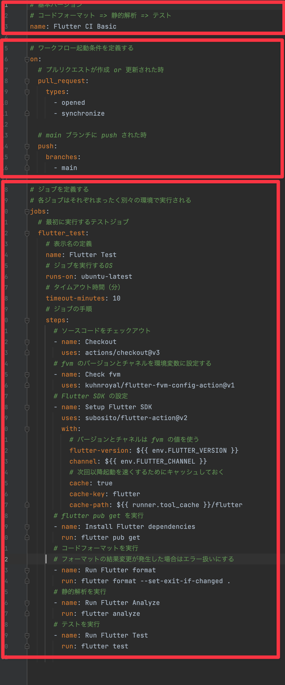
</center>

</div>
</div>

---

# ワークフロー名の定義

<div grid="~ cols-2 gap-4">
<div>

<br>

```yaml
name: Flutter CI Basic
```

</div>
<div>

<center>
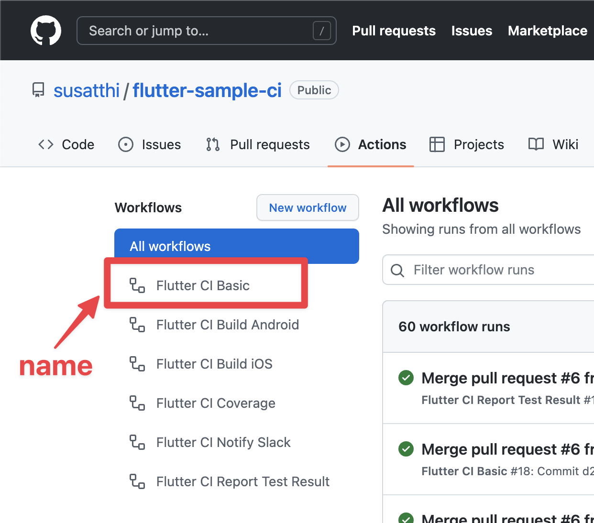
</center>

</div>
</div>

---

# ワークフローの起動条件の定義

<div grid="~ cols-2 gap-4">
<div>

<br>

```yaml
# ワークフロー起動条件を定義する
on:
  # プルリクエストが作成 or 更新された時
  pull_request:
    types:
      - opened
      - synchronize

  # main ブランチに push された時
  push:
    branches:
      - main
```

</div>
<div>

- オススメのワークフローの起動条件

  - プルリクエストが作成された時
  - プルリクエストが更新された時
  - main ブランチに push された時


</div>
</div>

---

# テストジョブの定義

次の簡単なテストジョブを定義してみます。

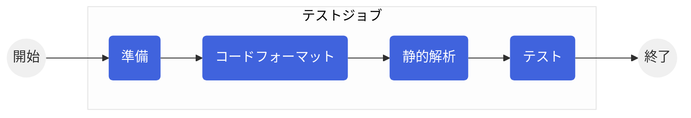
```mermaid
%%{init:{'theme':'base','themeVariables':{'primaryColor':'#f0f0f0','primaryTextColor':'#2f2f2f', 'lineColor':'#2f2f2f','textColor':'#2f2f2f','fontSize':'16px','nodeBorder':'0px'}}}%%
flowchart LR
    Start((開始)) --> Prepare(準備)
    subgraph テストジョブ
    Prepare --> Format(コードフォーマット)
    Format --> Analyze(静的解析)
    Analyze --> Test(テスト)
    end
    Test --> End((終了))

    classDef anchor fill:#4063DD, color:#ffffff;
    classDef testJob fill:#4063DD, color:#ffffff;
    %% class Start,End anchor;
    class Prepare,Format,Analyze,Test testJob;
```

テストには色々な種類のテストがあります。すべて GitHub Actions 上で実行できます（多分）。

|||
|--|--|
|単体テスト|関数の戻り値が期待値と一致するかを確認するテスト|
|Widget テスト|Widget を操作（タップなど）して意図した動きをするか確認するテスト|
|ゴールデンテスト|事前に正解のスクリーンショットを生成しておき、実際の画面イメージと比較をするテスト|
|インテグレーションテスト|Driver と呼ばれる擬似的なユーザを使って実際の操作をシミュレートするテスト|

---

# テストジョブの定義

```yaml
# ジョブを定義する
# 各ジョブはそれぞれまったく別々の環境で実行される
jobs:
  # 最初に実行するテストジョブ
  flutter_test:
    # 表示名の定義
    name: Flutter Test
    # ジョブを実行するOS
    runs-on: ubuntu-latest
    # タイムアウト時間（分）
    timeout-minutes: 10
    # ジョブの手順
    steps:
      ・・・
```

timeout-minutes のデフォルト値は 6 時間！ Private リポジトリは実行時間に応じて課金されます。処理が終わらないまま放置され莫大な請求額につながらないよう timeout-minutes は必ず指定しましょう。

---

# STEP: 準備

<div grid="~ cols-2 gap-4">
<div>

```yaml
      # ソースコードをチェックアウト
      - name: Checkout
        uses: actions/checkout@v3
      # fvm のバージョンとチャネルを環境変数に設定する
      - name: Check fvm
        uses: kuhnroyal/flutter-fvm-config-action@v1
      # Flutter SDK の設定
      - name: Setup Flutter SDK
        uses: subosito/flutter-action@v2
        with:
          # バージョンとチャネルは fvm の値を使う
          flutter-version: ${{ env.FLUTTER_VERSION }}
          channel: ${{ env.FLUTTER_CHANNEL }}
          # 次回以降起動を速くするためにキャッシュしておく
          cache: true
          cache-key: flutter
          cache-path: ${{ runner.tool_cache }}/flutter
      # flutter pub get を実行
      - name: Install Flutter dependencies
        run: flutter pub get
```

</div>
<div>

- ジョブ毎に OS を起動し直している

- fvm とは Flutter SDK のバージョン管理ツール
  - SDK バージョンをチームで統一できるほか、SDK のバージョンがあがったときにワークフロー定義ファイルを修正しなくてすむ

- subosito/flutter-action@v2 によって SDK バージョンが固定されるので、これ以降のコマンドは `fvm flutter` ではなく `flutter` で問題ない

- uses で他の人が作った便利なアクションを再利用できる

- `${{ }}` でコンテキスト（変数）を参照、[色々な変数が用意されている](https://docs.github.com/ja/actions/learn-github-actions/contexts)
</div>
</div>

---

# STEP: コードフォーマット

```yaml
      # コードフォーマットを実行
      # フォーマットの結果変更が発生した場合はエラー扱いにする
      - name: Run Flutter format
        run: flutter format --set-exit-if-changed .
```
<br>

<div grid="~ cols-2 gap-4">
<div>

<center>
🙅 フォーマットしていない
<br>
<br>
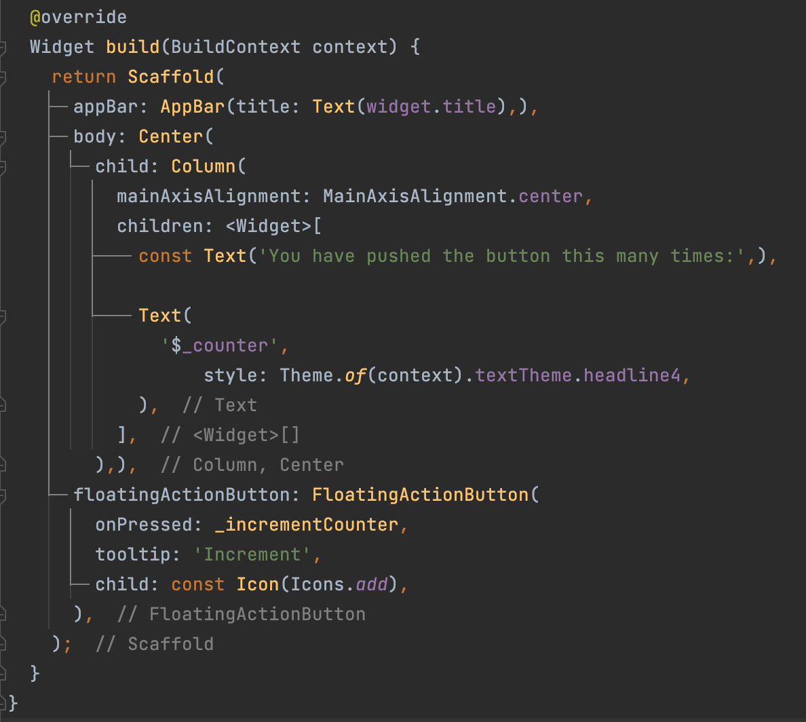
</center>

</div>
<div>

<center>
✅ フォーマットしている
<br>
<br>
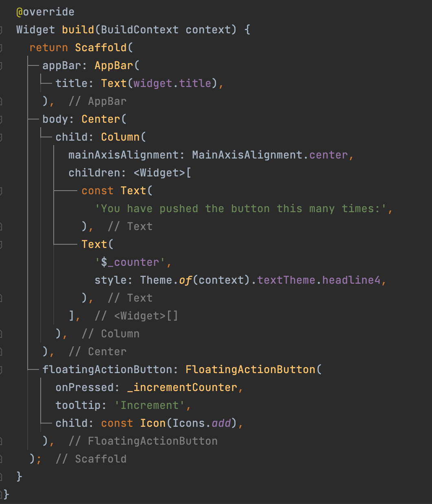
</center>

</div>
</div>


---

# STEP: 静的解析

<div grid="~ cols-2 gap-4">
<div>

```yaml
      # 静的解析を実行
      - name: Run Flutter Analyze
        run: flutter analyze
```

- 静的解析のメリット
  - コーディングスタイルをチームで統一でき、コードレビューがより有益なものになる
  - キレイなコードが書けるようになる

- デフォルトの [lints](https://pub.dev/packages/lints) パッケージでもよいし、より厳しくしたければ [pedantic_mono](https://pub.dev/packages/pedantic_mono) がオススメ

</div>
<div>


</div>
</div>

---

# STEP: テスト

```yaml
      # テストを実行
      - name: Run Flutter Test
        run: flutter test
```

Widgets テストの例

```dart
void main() {
  testWidgets('カウンターが増えるはず', (WidgetTester tester) async {
    // アプリを起動する
    await tester.pumpWidget(const MyApp());

    // 初期表示時は 0 になっているはず
    expect(find.text('0'), findsOneWidget);
    expect(find.text('1'), findsNothing);

    // +ボタン押下する
    await tester.tap(find.byIcon(Icons.add));
    await tester.pump();

    // カウンターが 1 になっているはず
    expect(find.text('0'), findsNothing);
    expect(find.text('1'), findsOneWidget);
  });
}
```

---

# ワークフローの定義ファイルを保存する

作成した YAML ファイルを .github/workflows/ に保存します。<br>
ファイル名はなんでも構いません。

<center>
  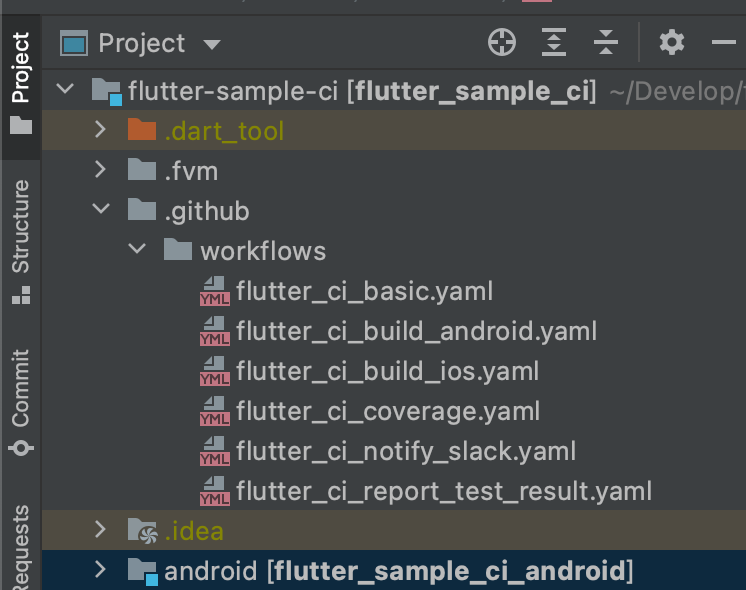
</center>

---

# 完成したワークフロー

<br>

https://github.com/susatthi/flutter-sample-ci/blob/main/.github/workflows/flutter_ci_basic.yaml

---

# ワークフローを動かしてみよう

準備が出来ました。さっそく修正を Commit & Push して、プルリクエストを作成してみましょう。ワークフローが起動しました 🎉

<center>
<video controls="controls" width="700">
<source src="/movies/run-basic.mov">
</video>
</center>


---
layout: section
---

# テスト結果を GitHub Actions 上に表示する

---

# テスト結果を GitHub Actions 上に表示する

GitHub Actions 上で実行したテストの結果を確認するには、わざわざ実行ログを見る必要があります。ささっと確認ができるようにするためにテスト結果を GitHub Actions 上に表示するようにしましょう。

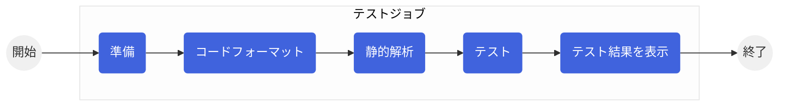
```mermaid
%%{init:{'theme':'base','themeVariables':{'primaryColor':'#f0f0f0','primaryTextColor':'#2f2f2f', 'lineColor':'#2f2f2f','textColor':'#2f2f2f','fontSize':'16px','nodeBorder':'0px'}}}%%
flowchart LR
    Start((開始)) --> Prepare(準備)
    subgraph テストジョブ
    Prepare --> Format(コードフォーマット)
    Format --> Analyze(静的解析)
    Analyze --> Test(テスト)
    Test --> Report(テスト結果を表示)
    end
    Report --> End((終了))

    classDef anchor fill:#4063DD, color:#ffffff;
    classDef testJob fill:#4063DD, color:#ffffff;
    classDef buildJob fill:#d32f2f, color:#ffffff;
    classDef reportJob fill:#437C40, color:#ffffff;
    %% class Start,End anchor;
    class Prepare,Format,Analyze,Test,Report testJob;
    class BuildAndroid,BuildiOS buildJob;
    class NotifySlack reportJob;
```

<square width="200" height="200" />


    
<br>

<center>
  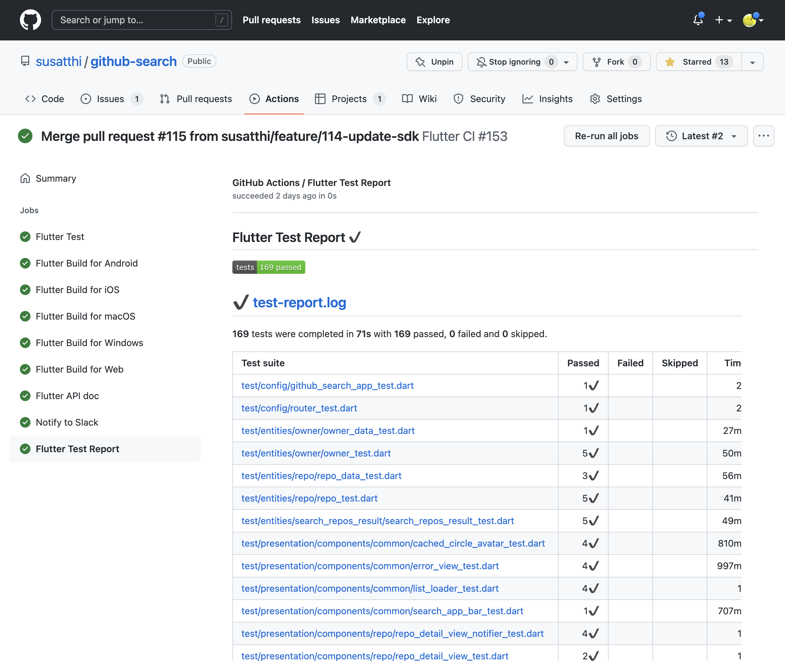
</center>

---

# STEP: テスト＆テスト結果を表示する

「STEP: 静的解析」までは同じです。

```yaml {2,4,6-}
      # テストを実行
      # あとでテスト結果を表示するので log に出力する
      - name: Run Flutter Test
        run: flutter test --machine > test-report.log

      # テスト結果を GitHub Actions に表示する
      - name: Report Test
        uses: dorny/test-reporter@v1
        # テスト結果を表示するのでテストが失敗しても実行する
        if: always()
        with:
          name: Flutter Test Report
          path: test-report.log
          reporter: flutter-json
```

- `if: ${{ <expression> }}` で if 文のようなことができる ( if の `${{ }}` は省略可 )
- `always()` はもともと用意されているもので常に `true` を返す
- ほかにも [いろいろ](https://docs.github.com/ja/actions/learn-github-actions/expressions) あります
---

# GitHub の設定を変更する

<div grid="~ cols-2 gap-4">
<div>

- Bot が GITHUB_TOKEN を使って書き込みを行うための権限を付与します。


</div>
<div>
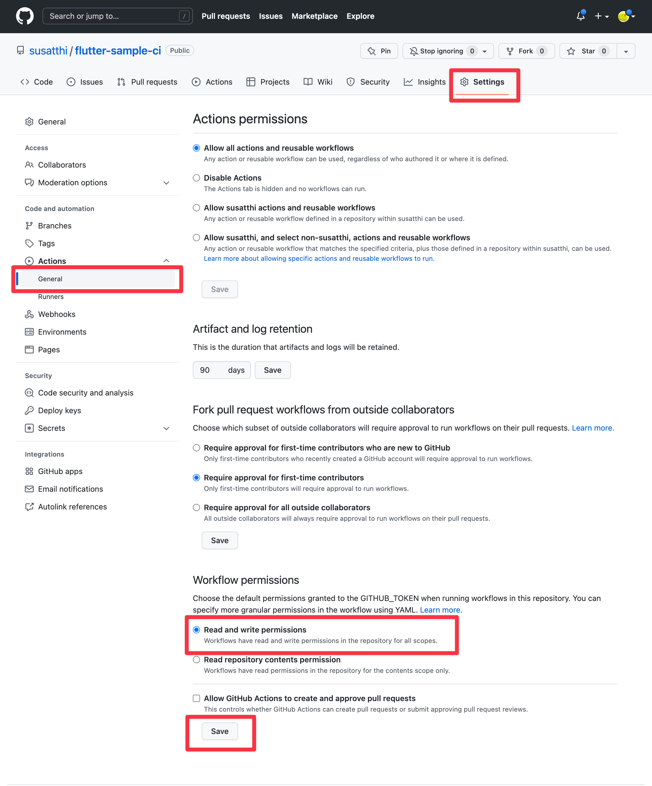

- 注意点
  - ワークフローが複数あると、別のワークフローに表示されることがあるようです 😅

</div>
</div>

---

# 完成したワークフロー

<br>

https://github.com/susatthi/flutter-sample-ci/blob/main/.github/workflows/flutter_ci_report_test_result.yaml

---

# テスト結果が表示出来ました 🎉

https://github.com/susatthi/github-search/runs/6402045178?check_suite_focus=true

<center>

</center>

---
layout: section
---

# テストカバレッジを測定しよう

---

# カバレッジとは？

- テストの網羅率

- コード全体のうちテストしたルートが占める割合のこと

- Codecov を利用します

<center>
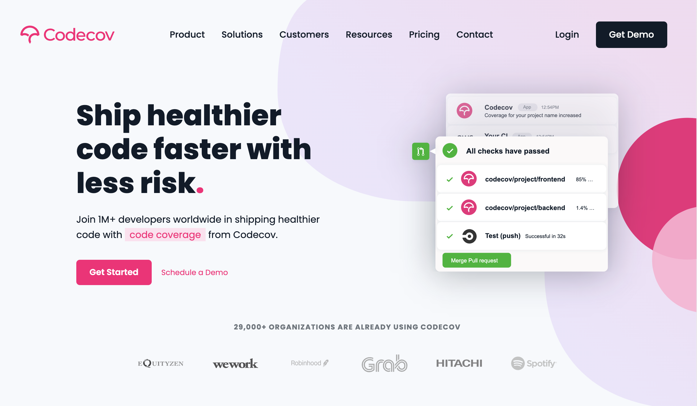
</center>
---

# テストカバレッジを測定しよう

カバレッジを可視化して網羅率を上げることは品質向上に役立ちます。カバレッジを測定するサービスである Codecov に結果を送信し、Codecov のサイト上でカバレッジの結果を見られるようにしましょう。

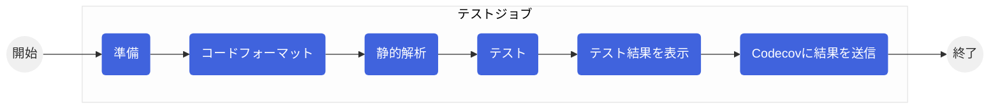
```mermaid
%%{init:{'theme':'base','themeVariables':{'primaryColor':'#f0f0f0','primaryTextColor':'#2f2f2f', 'lineColor':'#2f2f2f','textColor':'#2f2f2f','fontSize':'16px','nodeBorder':'0px'}}}%%
flowchart LR
    Start((開始)) --> Prepare(準備)
    subgraph テストジョブ
    Prepare --> Format(コードフォーマット)
    Format --> Analyze(静的解析)
    Analyze --> Test(テスト)
    Test --> Report(テスト結果を表示)
    Report --> UploadCoverage(Codecovに結果を送信)
    end
    UploadCoverage --> End((終了))

    classDef anchor fill:#4063DD, color:#ffffff;
    classDef testJob fill:#4063DD, color:#ffffff;
    classDef buildJob fill:#d32f2f, color:#ffffff;
    classDef reportJob fill:#437C40, color:#ffffff;
    %% class Start,End anchor;
    class Prepare,Format,Analyze,Test,Report,UploadCoverage testJob;
    class BuildAndroid,BuildiOS buildJob;
    class NotifySlack reportJob;
```


<div grid="~ cols-2 gap-4">
<div>

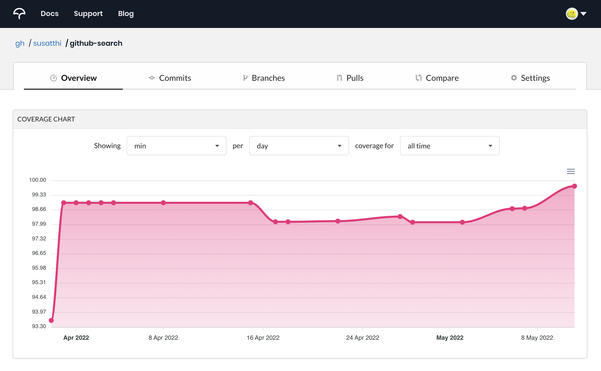

</div>
<div>

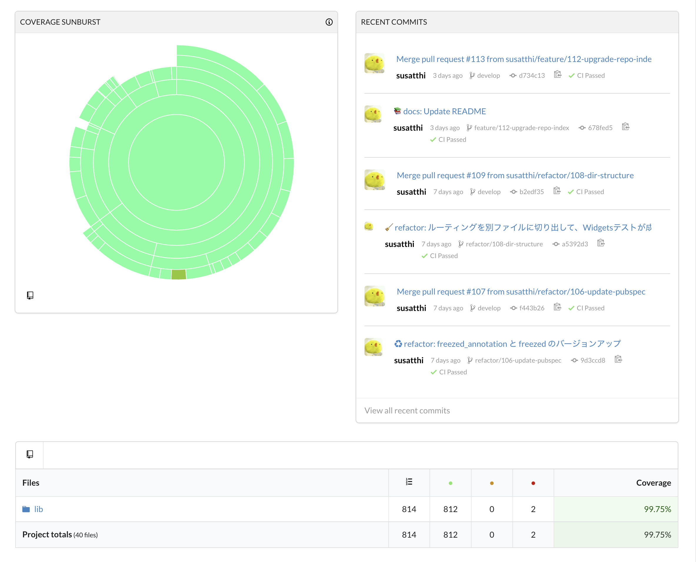

</div>
</div>

---

# STEP: Codecovに結果を送信

```yaml {3,5,9-}
      # テストを実行
      # あとでテスト結果を表示するので log に出力する
      # Codecovに結果を送信するのでカバレッジありで実行する
      - name: Run Flutter Test
        run: flutter test --machine --coverage > test-report.log

      ・・・

      # Codecov に結果を送信
      - name: Upload coverage to Codecov
        uses: codecov/codecov-action@v2
        with:
          file: coverage/lcov.info
          fail_ci_if_error: true
          flags: unittests
          verbose: true
```

---

# 完成したワークフロー

<br>

https://github.com/susatthi/flutter-sample-ci/blob/main/.github/workflows/flutter_ci_coverage.yaml

---

# Codecov で結果を確認できました 🎉

https://app.codecov.io/gh/susatthi/github-search

<center>
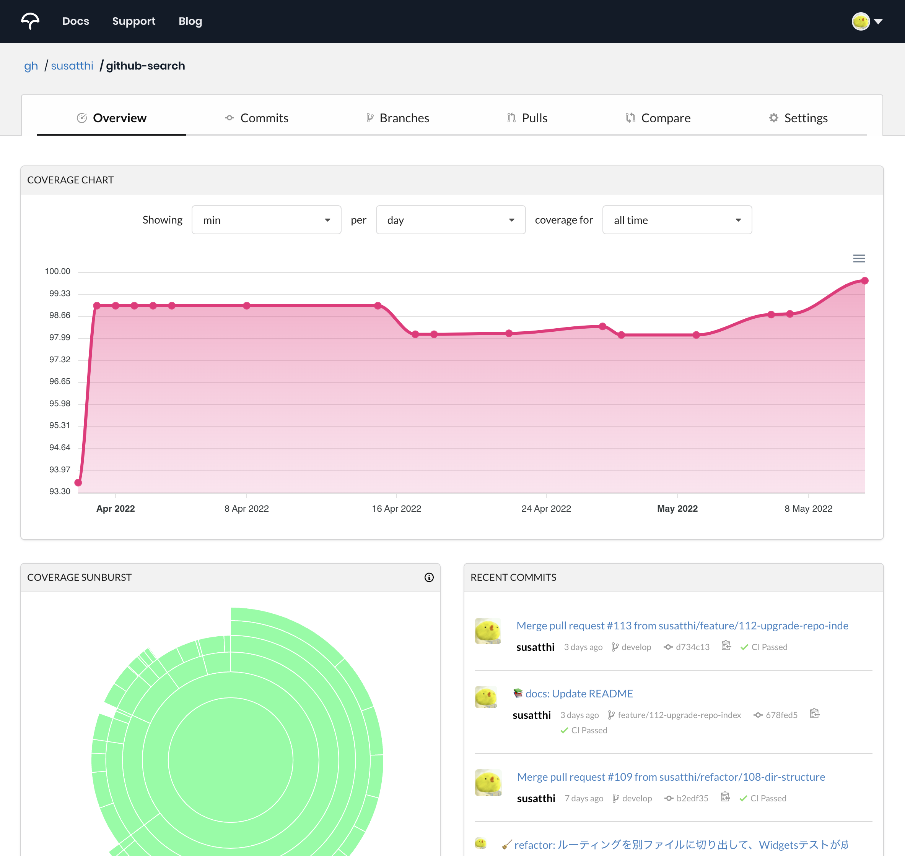
</center>

---

# PR のコメントでも結果を確認できます 🎉

https://github.com/susatthi/github-search/pull/113

<center>
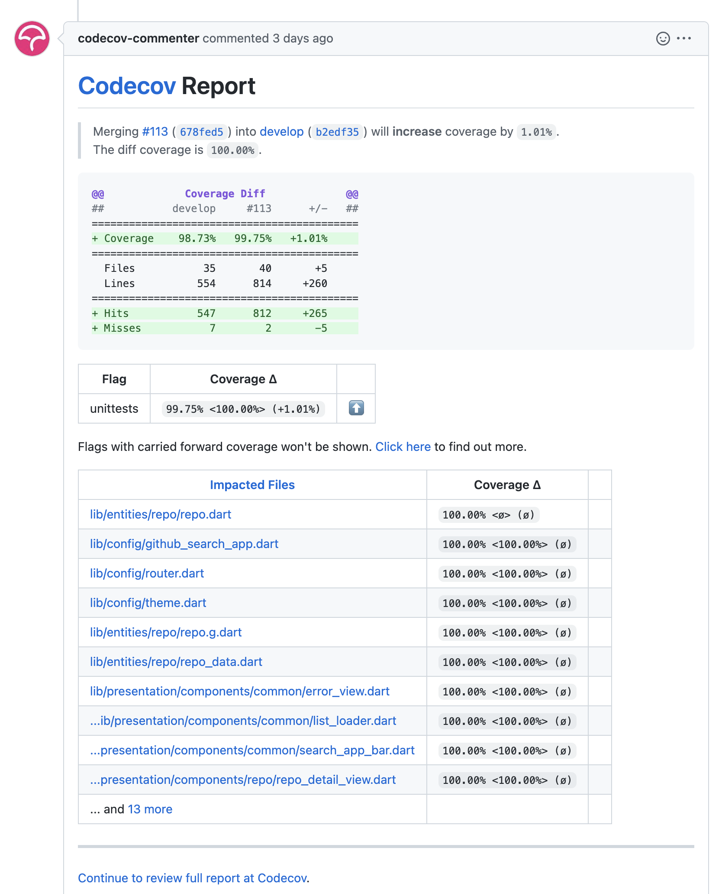
</center>

---

# README にバッジを付けてドヤれます 🎉

https://github.com/susatthi/github-search

<center>
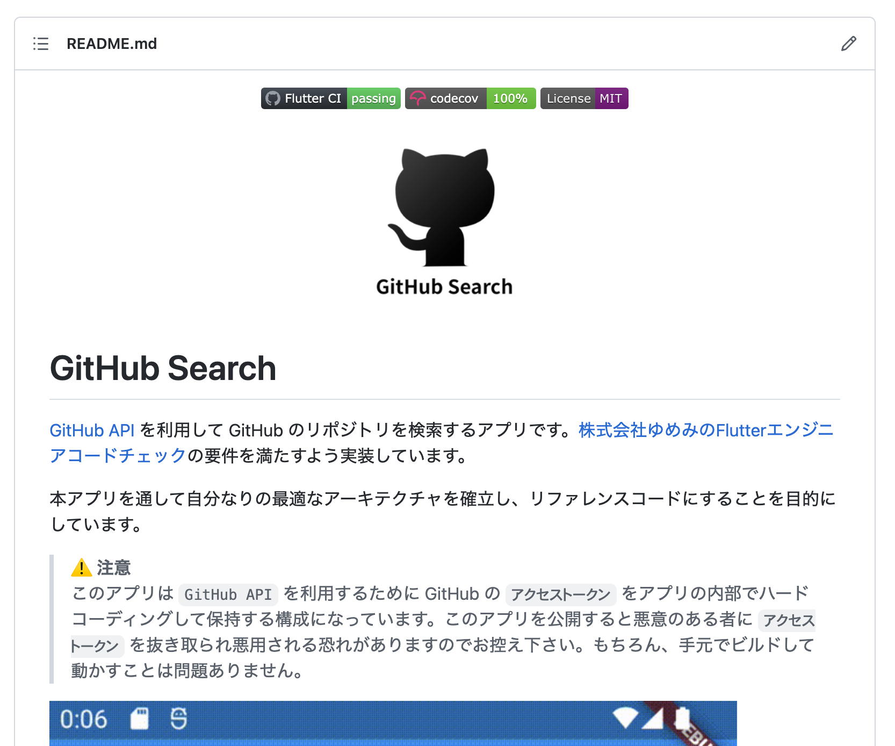
</center>

---
layout: section
---

# CI の結果を Slack に通知しよう

---

# CI の結果を Slack に通知しよう

テストで失敗したときはいち早く知りたいですよね。いつも使っている Slack に結果を通知できればうれしいです。やってみましょう！


```mermaid
%%{init:{'theme':'base','themeVariables':{'primaryColor':'#f0f0f0','primaryTextColor':'#2f2f2f', 'lineColor':'#2f2f2f','textColor':'#2f2f2f','fontSize':'16px','nodeBorder':'0px'}}}%%
flowchart LR
    Start((開始)) --> Prepare(準備)
    subgraph テストジョブ
    Prepare --> Format(コードフォーマット)
    Format --> Analyze(静的解析)
    Analyze --> Test(テスト)
    Test --> Report(テスト結果を表示)
    Report --> UploadCoverage(Codecovに結果を送信)
    end
    subgraph レポートジョブ
    UploadCoverage ---> NotifySlack(Slackに結果を送信)
    end
    NotifySlack --> End((終了))

    classDef anchor fill:#4063DD, color:#ffffff;
    classDef testJob fill:#4063DD, color:#ffffff;
    classDef buildJob fill:#d32f2f, color:#ffffff;
    classDef reportJob fill:#437C40, color:#ffffff;
    %% class Start,End anchor;
    class Prepare,Format,Analyze,Test,Report,UploadCoverage testJob;
    class BuildAndroid,BuildiOS buildJob;
    class NotifySlack reportJob;
```


<center>
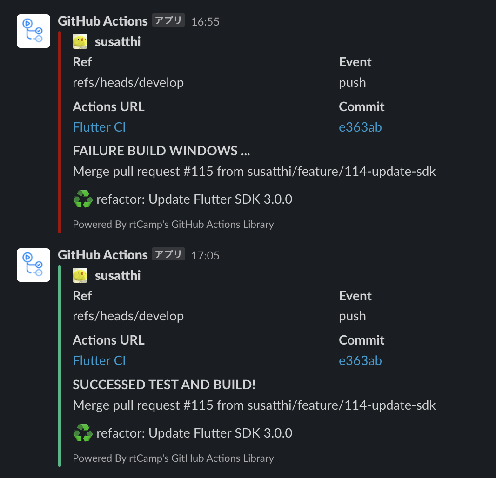
</center>

---

# Slack の準備

- Incoming Webhooks アプリを Slack に追加し Webhook URL を取得する

<center>
<video controls="controls" width="650">
<source src="/movies/incoming-webhooks.mp4">
</video>
</center>

---

# GitHub の準備

- Webhook URL を GitHub Secrets に SLACK_WEBHOOK_URL という名前で登録する

<center>
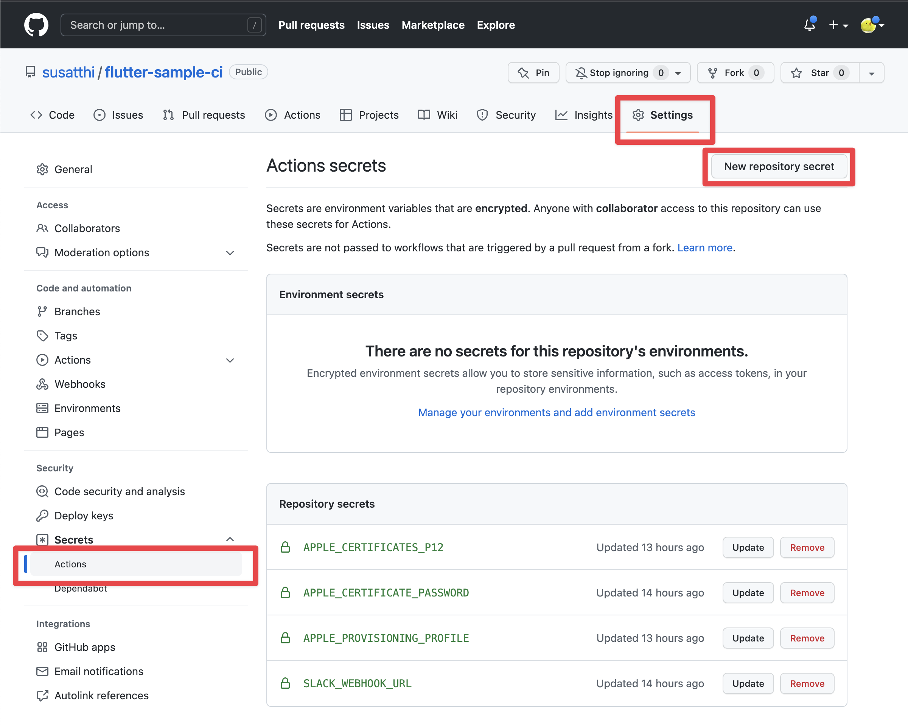
</center>

---

# Slack 通知ジョブを追加

<div grid="~ cols-2 gap-4">
<div>

```yaml
  # Slack通知ジョブ
  notify_slack:
    name: Notify to Slack
    # 前のジョブの成否によらず常に実行する
    if: ${{ always() }}
    # すべてのジョブが終了したら実行する
    needs:
      - flutter_test
    # ジョブを実行するOS
    runs-on: ubuntu-latest
    # ここで環境変数を設定すると steps 配下で使えるようになる
    env:
      SLACK_USERNAME: GitHub Actions
      SLACK_ICON: https://raw.githubusercontent.com/github/explore/2c7e603b797535e5ad8b4beb575ab3b7354666e1/topics/actions/actions.png
      SLACK_WEBHOOK: ${{ secrets.SLACK_WEBHOOK_URL }}
```

</div>
<div>

```yaml
    # ジョブの手順
    steps:
      # すべて成功したとき
      - name: Notify Success
        if: ${{ !contains(needs.*.result, 'failure') }}
        uses: rtCamp/action-slack-notify@v2
        env:
          SLACK_TITLE: SUCCESS TEST!
          SLACK_COLOR: good
      # テストに失敗したとき
      - name: Notify Failure Test
        if: ${{ needs.flutter_test.result == 'failure' }}
        uses: rtCamp/action-slack-notify@v2
        env:
          SLACK_TITLE: FAILURE TEST ...
          SLACK_COLOR: danger
```

</div>
</div>

---

# 完成したワークフロー

<br>

https://github.com/susatthi/flutter-sample-ci/blob/main/.github/workflows/flutter_ci_notify_slack.yaml

---

# ワークフローの結果が Slack に通知されました 🎉
https://flutteruniv.slack.com/archives/C037LFDNF39/p1652342741852409

<center>

</center>

---

ここまでできると CI として十分機能していると思います。

でも、テストを書くのはだるそうですよね。

特に途中からテストを書きはじめるのは本当にだるいです。テストを書くのはものすごく心理的ハードルが高いです。

でも、いつでもテスト始められる環境を整えておけば、そのハードルが少し下がると思います。

ぜひ、出来るところから CI を導入してみてはいかがでしょうか？

<br>
<br>

ここから先のリリースビルドジョブはぶっちゃけ導入しなくてもよいですが、CD (継続的デリバリー) をやる場合には必須になりますので参考にしてください。

---
layout: section
---

# Android リリースビルド

---

# Android リリースビルド


```mermaid
%%{init:{'theme':'base','themeVariables':{'primaryColor':'#f0f0f0','primaryTextColor':'#2f2f2f', 'lineColor':'#2f2f2f','textColor':'#2f2f2f','fontSize':'16px','nodeBorder':'0px'}}}%%
flowchart LR
    Start((開始)) --> Prepare(準備)
    subgraph テストジョブ
    Prepare --> Format(コードフォーマット)
    Format --> Analyze(静的解析)
    Analyze --> Test(テスト)
    Test --> Report(テスト結果を表示)
    Report --> UploadCoverage(Codecovに結果を送信)
    end
    subgraph ビルドジョブ
    UploadCoverage --> BuildAndroid(Androidビルド)
    end
    subgraph レポートジョブ
    BuildAndroid ---> NotifySlack(Slackに結果を送信)
    end
    NotifySlack --> End((終了))

    classDef anchor fill:#4063DD, color:#ffffff;
    classDef testJob fill:#4063DD, color:#ffffff;
    classDef buildJob fill:#d32f2f, color:#ffffff;
    classDef reportJob fill:#437C40, color:#ffffff;
    %% class Start,End anchor;
    class Prepare,Format,Analyze,Test,Report,UploadCoverage testJob;
    class BuildAndroid,BuildiOS buildJob;
    class NotifySlack reportJob;
```


<br>

- テストの結果は早く知りたいのでビルドよりもテストを優先する
- ビルドはテストが成功したときのみ実行する
- もし Android ビルドジョブが失敗したら Slack への通知時にその旨を含める

---

# Android ビルドジョブを追加

テストジョブと同じような準備が必要。。。CircleCI の commands のように Step をメソッド化できるようになることを期待。

<div grid="~ cols-2 gap-4">
<div>

```yaml
  # Android ビルドジョブ
  flutter_build_android:
    name: Flutter Build for Android
    # テストジョブが成功したら実行する
    needs:
      - flutter_test
    # ジョブを実行するOS
    runs-on: ubuntu-latest
    # タイムアウト時間（分）
    timeout-minutes: 10
    # ジョブの手順
    steps:
      # ソースコードをチェックアウト
      - name: Checkout
        uses: actions/checkout@v3
      # fvm のバージョンとチャネルを環境変数に設定する
      - name: Check fvm
        uses: kuhnroyal/flutter-fvm-config-action@v1
      # Flutter SDK の設定
      - name: Setup Flutter SDK
        uses: subosito/flutter-action@v2
```

</div>
<div>

```yaml
        with:
          # バージョンとチャネルは fvm の値を使う
          flutter-version: ${{ env.FLUTTER_VERSION }}
          channel: ${{ env.FLUTTER_CHANNEL }}
          # 次回以降起動を速くするためにキャッシュしておく
          cache: true
          cache-key: flutter
          cache-path: ${{ runner.tool_cache }}/flutter
      # flutter pub get を実行
      - name: Install Flutter dependencies
        run: flutter pub get
      # リリースビルドを実行
      - name: Build for Android
        run: flutter build appbundle -t lib/main.dart --release
```

</div>
</div>

---

# Slack 通知ジョブを修正

<div grid="~ cols-2 gap-4">
<div>

```yaml {9}
  # Slack通知ジョブ
  notify_slack:
    name: Notify to Slack
    # 前のジョブの成否によらず常に実行する
    if: ${{ always() }}
    # すべてのジョブが終了したら実行する
    needs:
      - flutter_test
      - flutter_build_android
    # ジョブを実行するOS
    runs-on: ubuntu-latest
    # ここで環境変数を設定すると steps 配下で使えるようになる
    env:
      SLACK_USERNAME: GitHub Actions
      SLACK_ICON: https://raw.githubusercontent.com/github/explore/2c7e603b797535e5ad8b4beb575ab3b7354666e1/topics/actions/actions.png
      SLACK_WEBHOOK: ${{ secrets.SLACK_WEBHOOK_URL }}
```

</div>
<div>

```yaml {17-}
    # ジョブの手順
    steps:
      # すべて成功したとき
      - name: Notify Success
        if: ${{ !contains(needs.*.result, 'failure') }}
        uses: rtCamp/action-slack-notify@v2
        env:
          SLACK_TITLE: SUCCESS TEST AND BUILD!
          SLACK_COLOR: good
      # テストに失敗したとき
      - name: Notify Failure Test
        if: ${{ needs.flutter_test.result == 'failure' }}
        uses: rtCamp/action-slack-notify@v2
        env:
          SLACK_TITLE: FAILURE TEST ...
          SLACK_COLOR: danger
      # Android ビルドに失敗したとき
      - name: Notify Failure Build for Android
        if: ${{ needs.flutter_build_android.result == 'failure' }}
        uses: rtCamp/action-slack-notify@v2
        env:
          SLACK_TITLE: FAILURE BUILD ANDROID ...
          SLACK_COLOR: danger
```

</div>
</div>

---

# 完成したワークフロー

<br>

https://github.com/susatthi/flutter-sample-ci/blob/main/.github/workflows/flutter_ci_build_android.yaml

---

# Android ビルドジョブが実行されました 🎉

https://github.com/susatthi/flutter-sample-ci/actions/runs/2318359074

<center>
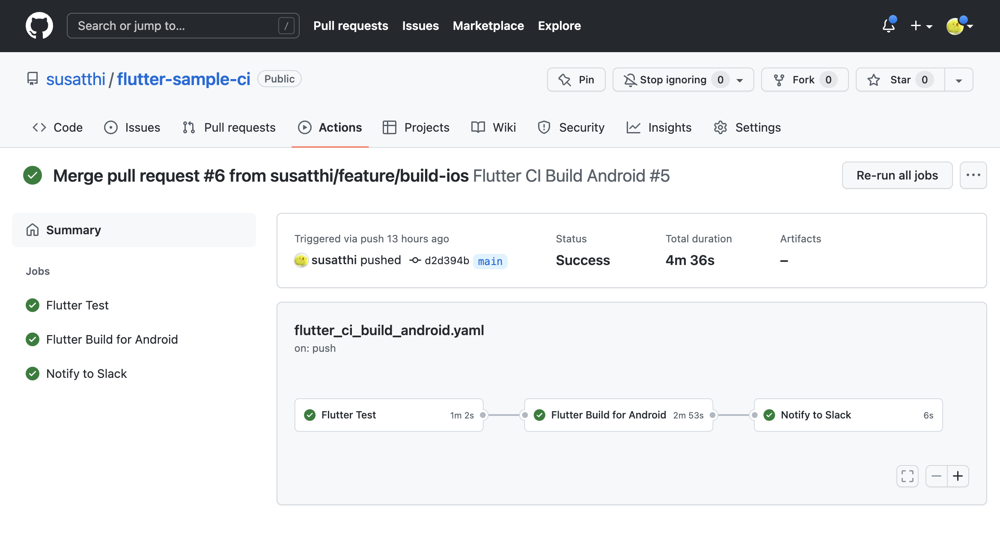
</center>

---
layout: section
---

# iOS リリースビルド

---

# iOS リリースビルド

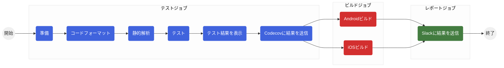
```mermaid
%%{init:{'theme':'base','themeVariables':{'primaryColor':'#f0f0f0','primaryTextColor':'#2f2f2f', 'lineColor':'#2f2f2f','textColor':'#2f2f2f','fontSize':'16px','nodeBorder':'0px'}}}%%
flowchart LR
    Start((開始)) --> Prepare(準備)
    subgraph テストジョブ
    Prepare --> Format(コードフォーマット)
    Format --> Analyze(静的解析)
    Analyze --> Test(テスト)
    Test --> Report(テスト結果を表示)
    Report --> UploadCoverage(Codecovに結果を送信)
    end
    subgraph ビルドジョブ
    UploadCoverage --> BuildAndroid(Androidビルド)
    UploadCoverage --> BuildiOS(iOSビルド)
    end
    subgraph レポートジョブ
    BuildAndroid ---> NotifySlack(Slackに結果を送信)
    BuildiOS ---> NotifySlack
    end
    NotifySlack --> End((終了))

    classDef anchor fill:#4063DD, color:#ffffff;
    classDef testJob fill:#4063DD, color:#ffffff;
    classDef buildJob fill:#d32f2f, color:#ffffff;
    classDef reportJob fill:#437C40, color:#ffffff;
    %% class Start,End anchor;
    class Prepare,Format,Analyze,Test,Report,UploadCoverage testJob;
    class BuildAndroid,BuildiOS buildJob;
    class NotifySlack reportJob;
```


- Android ビルドジョブと並列に行うことができる

- Private リポジトリの場合、Linux (Android) の 10 倍の利用料金がかかるので注意 😖
  - https://docs.github.com/ja/billing/managing-billing-for-github-actions/about-billing-for-github-actions

---

# iOS ビルドジョブを追加

基本的には Android ビルドジョブの追加と同じ

<div grid="~ cols-2 gap-4">
<div>

```yaml
  # iOS ビルドジョブ
  flutter_build_ios:
    name: Flutter Build for iOS
    # テストジョブが成功したら実行する
    needs:
      - flutter_test
    # ジョブを実行するOS
    runs-on: macos-latest
    # タイムアウト時間（分）
    timeout-minutes: 10
    # ジョブの手順
    steps:
      # ソースコードをチェックアウト
      - name: Checkout
        uses: actions/checkout@v3
      # fvm のバージョンとチャネルを環境変数に設定する
      - name: Check fvm
        uses: kuhnroyal/flutter-fvm-config-action@v1
```

</div>
<div>

```yaml
      # Flutter SDK の設定
      - name: Setup Flutter SDK
        uses: subosito/flutter-action@v2
        with:
          # バージョンとチャネルは fvm の値を使う
          flutter-version: ${{ env.FLUTTER_VERSION }}
          channel: ${{ env.FLUTTER_CHANNEL }}
          # 次回以降起動を速くするためにキャッシュしておく
          cache: true
          cache-key: flutter
          cache-path: ${{ runner.tool_cache }}/flutter
      # flutter pub get を実行
      - name: Install Flutter dependencies
        run: flutter pub get
```

</div>
</div>

---

# iOS ビルドジョブを追加

iOS はリリースビルド時にプロビジョニングファイルと証明書が必要

```yaml
      # プロビジョニングファイルの取り込み
      - name: Import Provisioning Profile
        run: |
          mkdir -p ~/Library/MobileDevice/Provisioning\ Profiles
          touch ~/Library/MobileDevice/Provisioning\ Profiles/decoded.mobileprovision
          echo -n '${{ secrets.APPLE_PROVISIONING_PROFILE }}' | base64 -d -o ~/Library/MobileDevice/Provisioning\ Profiles/decoded.mobileprovision
      # 証明書の取り込み
      - name: Import Code-Signing Certificates
        uses: Apple-Actions/import-codesign-certs@v1
        with:
          p12-file-base64: ${{ secrets.APPLE_CERTIFICATES_P12 }}
          p12-password: ${{ secrets.APPLE_CERTIFICATE_PASSWORD }}
      # リリースビルドを実行
      - name: Build for iOS
        run: flutter build ipa -t lib/main.dart --release
```

---

# Slack 通知ジョブを修正

<div grid="~ cols-2 gap-4">
<div>

```yaml {10}
  # Slack通知ジョブ
  notify_slack:
    name: Notify to Slack
    # 前のジョブの成否によらず常に実行する
    if: ${{ always() }}
    # すべてのジョブが終了したら実行する
    needs:
      - flutter_test
      - flutter_build_android
      - flutter_build_ios
    # ジョブを実行するOS
    runs-on: ubuntu-latest
    # ここで環境変数を設定すると steps 配下で使えるようになる
    env:
      SLACK_USERNAME: GitHub Actions
      SLACK_ICON: https://raw.githubusercontent.com/github/explore/2c7e603b797535e5ad8b4beb575ab3b7354666e1/topics/actions/actions.png
      SLACK_WEBHOOK: ${{ secrets.SLACK_WEBHOOK_URL }}
```

</div>
<div>

```yaml {4-}
    # ジョブの手順
    steps:
      ・・・
      # iOS ビルドに失敗したとき
      - name: Notify Failure Build for iOS
        if: ${{ needs.flutter_build_ios.result == 'failure' }}
        uses: rtCamp/action-slack-notify@v2
        env:
          SLACK_TITLE: FAILURE BUILD IOS ...
          SLACK_COLOR: danger
```

</div>
</div>
---

# GitHub の設定

<br>
GitHub Secrets に下記を登録する

|     |     |
| --- | --- |
| APPLE_CERTIFICATES_P12|iOS アプリのリリースビルドに必要な証明書 ( p12 ) ファイルを base64 エンコードした文字列|
|APPLE_CERTIFICATE_PASSWORD|証明書 ( p12 ) ファイルを書き出すときに設定したパスワード|
|APPLE_PROVISIONING_PROFILE|プロビジョニングファイルを base64 エンコードした文字列|

<div class="absolute bottom-10">
  <p>参考サイト:
    <a href="https://qiita.com/sakusaku3939/items/a2d0bc082d82f03a66a1">【Flutter】Github ActionでiOSアプリをDeployGateに自動デプロイする</a>
  </p>
</div>

---

# iOS プロジェクトファイルの修正

- XCodeを開いて、Runnerを選択して、Signing & Capabilities の Siging の Automatically manage signing のチェックを外し、Provisioning Profile を適切に設定する

<center>
<video controls="controls" width="600">
<source src="/movies/xcode.mp4">
</video>
</center>

---

# 完成したワークフロー

<br>

https://github.com/susatthi/flutter-sample-ci/blob/main/.github/workflows/flutter_ci_build_ios.yaml

---

# iOS ビルドジョブが実行されました 🎉

https://github.com/susatthi/flutter-sample-ci/actions/runs/2318359077

<center>
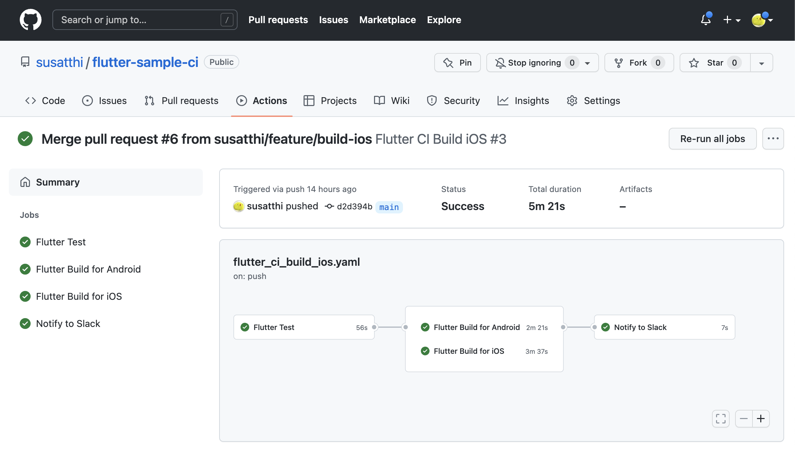
</center>

---
layout: section
---

# 実例

---

# macOS, Windows, Web のビルド

https://github.com/susatthi/github-search/actions/runs/2311927219

<center>
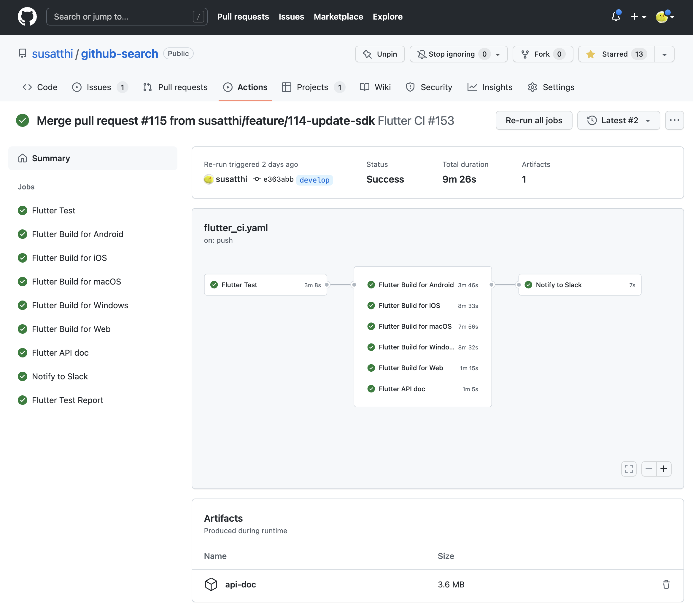
</center>

---

# 複数 OS × 複数 SDK バージョン のテスト
https://github.com/susatthi/roggle/actions/runs/2298012766

<center>
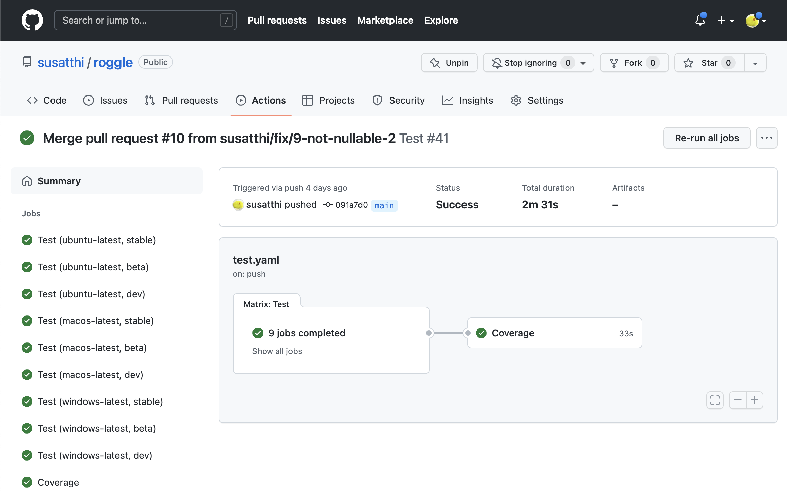
</center>

---
layout: section
---

# Tips

---

# 保存時自動フォーマットを有効にしよう

コードが見やすくなりコードレビューが楽になりますし、`{ }` や `[ ]` の対応ミスも減ります。

<div grid="~ cols-2 gap-4">
<div>

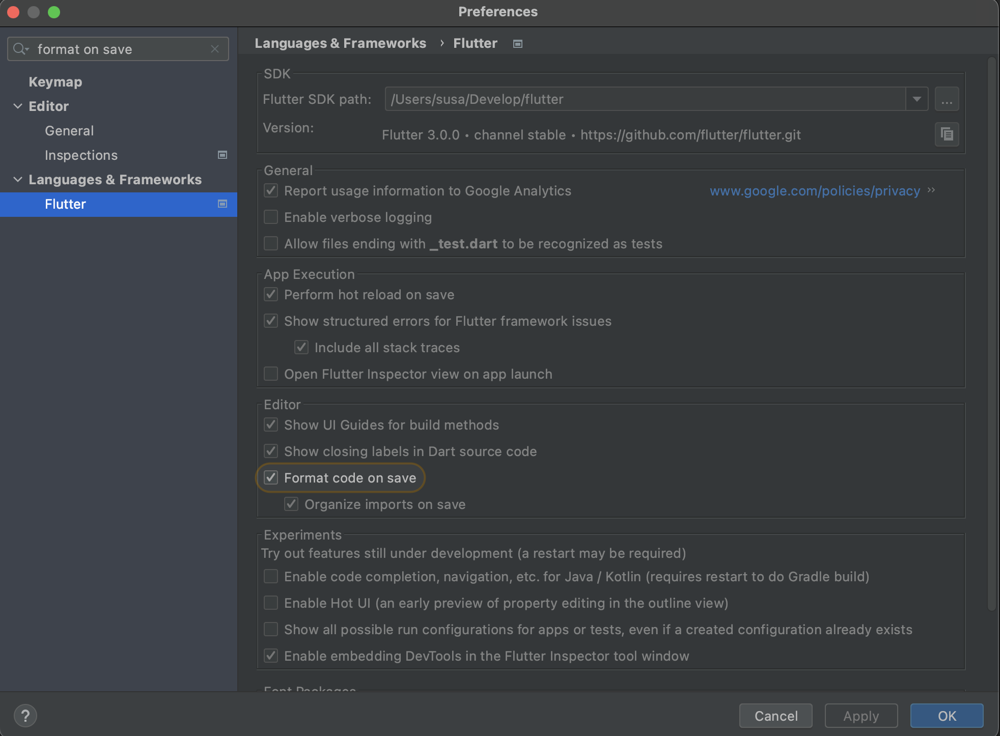

</div>
<div>

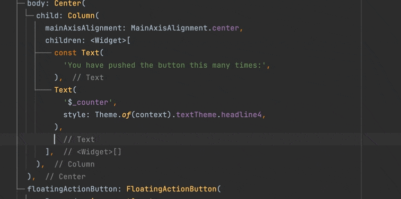

</div>
</div>

---

# ローカルテストを楽にしよう

Push 前にローカルでテストをしますが、毎回コマンド打つのが面倒です。そこで [ローカルでテストを楽に実行するスクリプト](https://github.com/susatthi/flutter-sample-ci/blob/main/bin/flutter_test) を使って静的解析＋テストを楽に実行できるようにしましょう。

<center>
<video controls="controls" width="630">
<source src="/movies/local-test.mp4">
</video>
</center>

---
layout: section
---

# コラム

---

# 2000 年代の CI

## Git 以前の CVS / SVN ( 集中管理方式 ) 全盛期

- GitHub が登場する以前は会社内に SVN / VCS をインストールしたバージョン管理サーバを運用
- [Jenkins](https://cloudbees.techmatrix.jp/jenkins/) をインストールしたサーバに CI を構築

<center>


https://www.dcom-web.co.jp/technology/jenkins/

</center>

---

# お金を掛けずに iOS ビルドをする方法

## Jenkins を使うという選択肢

Private リポジトリの場合、Linux (Android) の 10 倍の利用料金がかかるので、利用を躊躇しちゃいます。

- 使わなくなった Mac などに Jenkins をインストール
- Jenkins にリリースビルドと自動デプロイを構築


<div class="absolute bottom-10">
  <p>Xcode のアップデートとか、証明書やプロビジョニングファイルの管理が面倒なので正直オススメはしません。</p>
  <p>ですが、多くの Private リポジトリがある場合、コスト面で有利になる可能性があります。</p>
</div>

---

# バグは後工程になるほど工数がかかる

顧客にもよります、特に受託開発になると顧客都合の度合いが増えるので顕著。例えば致命的なバグが出ると、緊急対応で原因調査と修正、テスト（修正確認テスト、影響範囲テスト）、リリース、顧客へ報告、再発防止策の提示、、、と、修正以外にやることが増えてしまいます。バグは早期発見・早期改修にこしたことはありません。

<center>


[バグの早期検出メリットとその方法｜インスペクションのすすめ](https://shiftasia.com/ja/column/%E3%83%90%E3%82%B0%E3%81%AE%E6%97%A9%E6%9C%9F%E6%A4%9C%E5%87%BA%E3%83%A1%E3%83%AA%E3%83%83%E3%83%88%E3%81%A8%E3%81%9D%E3%81%AE%E6%96%B9%E6%B3%95/)

</center>

---

# 参考サイト

- [github-search](https://github.com/susatthi/github-search) （現在作成中のリファレンスアプリ）
- [flutter-sample-ci](https://github.com/susatthi/flutter-sample-ci) (今回作成のサンプルアプリ)
- [CI(継続的インテグレーション)とは？](https://cloudbees.techmatrix.jp/devops/ci/)
- [デグレをぶちかましたので、開発作業を1週間以上止められた話。](http://ht-jp.net/blog/pc/dev-memo/degrade)

